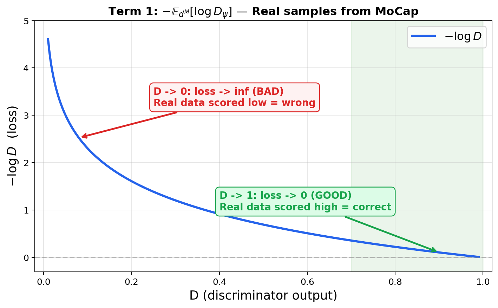
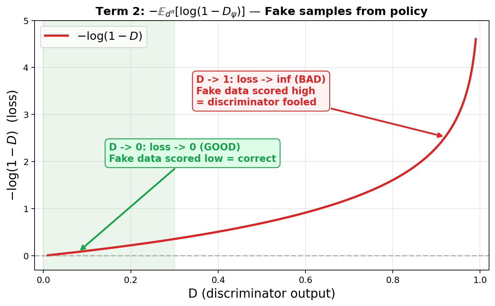

# AMP: Adversarial Motion Priors for Stylized Physics-Based Character Control
**对抗运动先验：风格化物理角色控制**

> 📅 阅读日期: -  
> 🏷️ 板块: Reinforcement Learning / Motion Imitation / Style Learning

---

## 📋 基本信息

| 项目 | 链接 |
|------|------|
| **arXiv** | [2104.02180](https://arxiv.org/abs/2104.02180) |
| **PDF** | [下载](https://arxiv.org/pdf/2104.02180) |
| **作者** | Xue Bin Peng, Ze Ma, Pieter Abbeel, Sergey Levine, Angjoo Kanazawa |
| **机构** | UC Berkeley |
| **发布时间** | 2021年（SIGGRAPH 2021） |
| **项目主页** | [xbpeng.github.io/projects/AMP](https://xbpeng.github.io/projects/AMP/) |
| **GitHub** | [nv-tlabs/ASE](https://github.com/nv-tlabs/ASE)（包含 AMP 实现）<br>[xbpeng/MimicKit](https://github.com/xbpeng/MimicKit) |

---

## 🎯 一句话总结

AMP 用 GAN 的思想替代了 DeepMimic 的手工模仿奖励——训练一个**鉴别器**来判断"这个动作像不像参考数据"，让策略**学会运动风格**而非逐帧复制，同时完成任务目标。

---

## ❓ 这篇论文要解决什么问题？

学完 DeepMimic 后你知道了：给一段动捕数据，用模仿奖励让 RL 智能体学会这个动作。但 DeepMimic 有三个明显的问题：

### 问题 1：奖励函数太难设计

DeepMimic 的模仿奖励有四个分量（关节姿态、速度、末端位置、质心），每个分量的权重和灵敏度系数都需要手工调节。换一种动作可能就需要重新调参。

### 问题 2：逐帧匹配太死板

DeepMimic 要求仿真角色在每一帧都尽量接近参考动作。这意味着：
- 角色被"绑定"在参考轨迹上，缺乏灵活性
- 如果参考动作有瑕疵（动捕噪声），角色也会学到这些瑕疵
- 不能同时模仿多段不同的动捕数据

### 问题 3：只能精确复制，不能学"风格"

你想让机器人用"某种风格"走路（比如大步流星 vs 小碎步），DeepMimic 要求你提供精确的动捕数据。但很多时候你只有一些参考片段，想让机器人自己去组合出符合这种风格的新动作。

> 💡 **类比**：DeepMimic 像是让学生**逐字抄写**范文——写出来确实工整，但换个题目就不会了。AMP 像是让学生**学习写作风格**——读几篇范文后，能用同样的风格写新文章。

---

## 🔧 AMP 是怎么做的？

### 核心思想：用 GAN 的鉴别器替代手工奖励

AMP 的灵感来自 GAN（生成对抗网络）：

- **GAN 中**：生成器生成图片，鉴别器判断"真假" → 生成器越来越会造假
- **AMP 中**：策略生成动作，鉴别器判断"像不像参考数据" → 策略越来越会模仿

具体来说：

| 角色 | GAN | AMP |
|------|-----|-----|
| **生成器** | 生成图片 | 策略 $\pi_\theta$ 生成动作 |
| **鉴别器** | 判断图片真假 | 判断状态转移 $(s_t, s_{t+1})$ 是否像参考数据 |
| **真实数据** | 真实照片 | 动捕参考数据 |
| **假数据** | 生成的图片 | 策略在仿真中产生的运动 |

### 鉴别器：判断"这段运动像不像人"

鉴别器 $D_\psi$ 的输入是一个**状态转移** $(s_t, s_{t+1})$，输出一个 0~1 的分数：

- 接近 1：这段运动看起来像参考数据（自然）
- 接近 0：这段运动看起来不像（不自然）

训练鉴别器的目标：

$$\min_\psi -\mathbb{E}_{d^M}\left[\log D_\psi(s_t, s_{t+1})\right] - \mathbb{E}_{d^\pi}\left[\log(1 - D_\psi(s_t, s_{t+1}))\right]$$

- $d^M$：从参考动捕数据中采样的状态转移（"真实"样本）
- $d^\pi$：从策略运行结果中采样的状态转移（"生成"样本）

#### 逐项拆解这个目标函数

这个公式直接来自 GAN 的经典目标函数（Goodfellow et al. 2014），只是把"图片"换成了"状态转移"。拆成两部分理解：

**第一项** $-\mathbb{E}_{d^M}[\log D_\psi(s_t, s_{t+1})]$：

- 从参考动捕数据 $d^M$ 中采一批 $(s_t, s_{t+1})$ 对
- 鉴别器应该对这些"真实"样本输出**接近 1** 的分数
- $\log D$ 在 $D \to 1$ 时趋近 0（loss 最小），在 $D \to 0$ 时趋近 $-\infty$（loss 最大）
- 前面有负号 → **最小化这一项 = 让鉴别器对真实数据输出尽可能高的分数**

> 📈 **$-\log D$ 函数图像**：横轴是鉴别器输出 $D$，纵轴是 loss 贡献。可以看到 $D \to 1$ 时 loss 趋近 0（绿色区域），$D \to 0$ 时 loss 急剧增大。这就是为什么最小化这一项会"逼迫"鉴别器对真实数据给高分。
>
> 

**第二项** $-\mathbb{E}_{d^\pi}[\log(1 - D_\psi(s_t, s_{t+1}))]$：

- 从策略产生的运动 $d^\pi$ 中采一批 $(s_t, s_{t+1})$ 对
- 鉴别器应该对这些"生成"样本输出**接近 0** 的分数
- $\log(1 - D)$ 在 $D \to 0$ 时趋近 0（loss 最小），在 $D \to 1$ 时趋近 $-\infty$（loss 最大）
- 前面有负号 → **最小化这一项 = 让鉴别器对策略生成的数据输出尽可能低的分数**

> 📈 **$-\log(1-D)$ 函数图像**：横轴是鉴别器输出 $D$，纵轴是 loss 贡献。可以看到 $D \to 0$ 时 loss 趋近 0（绿色区域），$D \to 1$ 时 loss 急剧增大。这就是为什么最小化这一项会"逼迫"鉴别器对策略生成的假数据给低分。
>
> 

#### 数值例子

假设有一批 4 个样本，鉴别器当前输出如下：

| 样本类型 | $(s_t, s_{t+1})$ 来源 | $D_\psi$ 输出 | 期望输出 |
|---------|----------------------|---------------|---------|
| 真实 #1 | 动捕走路片段 | 0.8 | → 1 |
| 真实 #2 | 动捕跑步片段 | 0.6 | → 1 |
| 生成 #1 | 策略在仿真中走路 | 0.3 | → 0 |
| 生成 #2 | 策略在仿真中摔倒 | 0.7 | → 0 |

计算 loss：

```
第一项（真实样本，越小越好）:
  -[log(0.8) + log(0.6)] / 2
  = -[(-0.223) + (-0.511)] / 2
  = -(-0.367) = 0.367

第二项（生成样本，越小越好）:
  -[log(1-0.3) + log(1-0.7)] / 2
  = -[log(0.7) + log(0.3)] / 2
  = -[(-0.357) + (-1.204)] / 2
  = -(-0.780) = 0.780

总 loss = 0.367 + 0.780 = 1.147
```

**生成 #2 的问题**：策略摔倒的动作被鉴别器打了 0.7 的高分（误判为真实），这导致第二项 loss 很大（$-\log(1-0.7) = 1.204$）。梯度下降会推动鉴别器降低对这个样本的输出，学会"摔倒不像真实运动"。

#### 鉴别器训练的完整伪代码

```python
for each training iteration:
    # 1. 采样真实数据
    real_transitions = sample_from_mocap(batch_size=512)
    # 每个 transition = (s_t, s_{t+1}), 从动捕中随机截取相邻两帧

    # 2. 采样生成数据
    fake_transitions = collect_from_policy(batch_size=512)
    # 用当前策略 πθ 在仿真中跑，收集 (s_t, s_{t+1}) 对

    # 3. 计算鉴别器 loss
    D_real = discriminator(real_transitions)   # 期望 → 1
    D_fake = discriminator(fake_transitions)   # 期望 → 0

    loss = -mean(log(D_real)) - mean(log(1 - D_fake))

    # 4. 加梯度惩罚（稳定训练，见附录 A）
    grad_penalty = compute_gradient_penalty(real_transitions)
    total_loss = loss + w_gp * grad_penalty

    # 5. 更新鉴别器参数 ψ
    optimizer.zero_grad()
    total_loss.backward()
    optimizer.step()
```

> 💡 **和标准 GAN 的区别**：标准 GAN 的鉴别器输入是一张图片（静态），AMP 的鉴别器输入是**一步状态转移** $(s_t, s_{t+1})$（动态）。这意味着鉴别器不是判断"一个姿势像不像人"，而是判断"从这个姿势到下一个姿势的变化过程像不像真实运动"——捕捉的是**运动的动态特征**。

#### 为什么是最小化而不是最大化？

你可能在其他资料里见过 GAN 的 minimax 形式：

$$\max_D \mathbb{E}_{d^M}[\log D] + \mathbb{E}_{d^\pi}[\log(1-D)]$$

这和 AMP 论文里的 $\min_\psi$ 形式是**完全等价的**——加个负号就行。AMP 论文写成 $\min$ 是为了和深度学习中"最小化 loss"的惯例一致，方便直接用 `optimizer.step()` 做梯度下降。

### 风格奖励：鉴别器的输出直接当奖励

策略的奖励由两部分组成：

$$r_t = w^S \cdot r_t^S + w^G \cdot r_t^G$$

其中**风格奖励**直接来自鉴别器：

$$r_t^S = -\log(1 - D_\psi(s_t, s_{t+1}))$$

- 鉴别器觉得越像参考 → $D$ 越大 → $r^S$ 越高
- 鉴别器觉得不像参考 → $D$ 越小 → $r^S$ 越低

**任务奖励** $r_t^G$ 和以前一样（如前进速度）。

> 💡 **关键洞察**：你不需要手工设计"像不像"的奖励——让神经网络（鉴别器）自己去学什么叫"像"。这就像不用告诉裁判"好的体操动作应该膝盖弯多少度"，而是给裁判看一堆优秀选手的视频，让他自己学会评分。

### 为什么 AMP 比 DeepMimic 灵活？

| | DeepMimic | AMP |
|---|---|---|
| **匹配方式** | 逐帧对齐 | 匹配运动分布 |
| **参考数据** | 单段完整轨迹 | 可以是多段不同片段的集合 |
| **奖励设计** | 手工设计4个分量+权重 | 鉴别器自动学习 |
| **时间对齐** | 需要知道"当前应该在第几帧" | 不需要，只看状态转移像不像 |
| **灵活性** | 只能复制参考轨迹 | 可以创造新动作，只要"风格"对 |

### 训练流程

```
输入: 参考动捕数据集 M = {片段1, 片段2, ...}

┌──→ ① 用策略 πθ 在仿真中收集运动数据
│       │
│       ▼
│    ② 更新鉴别器 Dψ:
│       - 真样本: 从 M 中随机采 (s,s') 对
│       - 假样本: 从策略运动中采 (s,s') 对
│       - 训练鉴别器区分真假
│       │
│       ▼
│    ③ 计算奖励: r = w^S · (-log(1-D(s,s'))) + w^G · r_task
│       │
│       ▼
│    ④ 用 PPO 更新策略 πθ (最大化奖励)
│       │
│       ▼
│    收敛? ──Yes──→ 完成 🎉
│       │No
└───────┘

策略和鉴别器交替训练，互相对抗，最终：
- 鉴别器越来越"聪明"，能发现细微的不自然
- 策略越来越"逼真"，动作风格越来越像参考数据
```

---

## 🚶 具体实例：用 AMP 训练人形角色用不同风格走路

论文的核心实验之一是 **Target Heading 任务**：给定一个目标方向和目标速度，让角色以特定运动风格沿该方向行走。下面以此为例走一遍完整流程。

### 环境设定（论文原文参数）

| 项目 | 具体值 |
|------|--------|
| **物理引擎** | Bullet Physics |
| **仿真频率** | 1200 Hz（物理步进 1.2kHz） |
| **控制频率** | 30 Hz（策略每秒查询 30 次） |
| **仿真角色** | Humanoid，34 DoF |
| **控制器** | PD 控制器（策略输出目标关节角度，球关节用 3D 指数映射，旋转关节用 1D 角度） |
| **参考数据** | 多段不同风格的动捕片段（CMU/SFU 动捕库 + 自录 + 美术关键帧），最大数据集 56 段共 434 秒 |

#### 角色状态空间

AMP 的状态特征**全部在角色局部坐标系**下表示（以骨盆为原点，角色朝向为 x 轴）：

| 特征 | 说明 |
|------|------|
| 根节点线速度 | 骨盆在局部坐标系下的 3D 线速度 |
| 根节点角速度 | 骨盆在局部坐标系下的 3D 角速度 |
| 各关节局部旋转 | 用 **6D 法线/切线** 表示（两个 3D 向量），避免万向锁 |
| 各关节局部速度 | 每个关节的角速度 |
| 末端执行器 3D 位置 | 手脚在局部坐标系下的位置 |

> 💡 **关键设计**：状态中**不包含全局位置和全局朝向**——运动风格与"在房间哪个位置"无关。也**不包含相位变量**——AMP 不需要知道"当前在参考动作的第几帧"，这是和 DeepMimic 的本质区别。

#### 鉴别器观察空间 vs 策略观察空间

| | 策略 $\pi$ | 鉴别器 $D$ |
|---|---|---|
| **关节状态** | ✅ | ✅ |
| **末端位置** | ✅ | ✅ |
| **任务目标**（方向、速度等） | ✅ | ❌ |
| **地形高度图**（障碍任务） | ✅ | ❌ |

鉴别器**不接收任务相关信息**——它只关心"运动像不像参考数据"，与具体任务无关。这使得同一个鉴别器可以复用于不同任务。

#### 网络架构

| 网络 | 结构 | 输出 |
|------|------|------|
| **策略 $\pi$** | 1024 → 512，ReLU | 高斯分布均值（固定对角协方差） |
| **价值函数 $V$** | 1024 → 512，ReLU | 1D 标量 |
| **鉴别器 $D$** | 1024 → 512，ReLU | 1D 标量（输入为 $(\Phi(s_t), \Phi(s_{t+1}))$） |

#### 训练超参数（Table 4）

| 参数 | 单片段模仿 | 任务训练 |
|------|-----------|---------|
| 每轮采样数 | 4096 | 4096 |
| RL Batch Size | 256 | 256 |
| 鉴别器 Batch Size | 256 | 256 |
| 策略学习率 | $2 \times 10^{-6}$ | $4 \times 10^{-6}$ |
| 价值函数学习率 | $1 \times 10^{-4}$ | $2 \times 10^{-5}$ |
| 鉴别器学习率 | $1 \times 10^{-5}$ | $1 \times 10^{-5}$ |
| 折扣因子 $\gamma$ | 0.95 | 0.99 |
| GAE $\lambda$ | 0.95 | 0.95 |
| PPO clip $\epsilon$ | 0.02 | 0.02 |
| 优化器 | SGD, momentum=0.9 | SGD, momentum=0.9 |
| 风格权重 $w^S$ | — | 0.5 |
| 任务权重 $w^G$ | — | 0.5 |
| 梯度惩罚 $w_{GP}$ | 10 | 10 |
| 鉴别器回放缓冲区 | $10^5$ | $10^5$ |

> 💡 **注意 PPO clip = 0.02**，远小于 DeepMimic 的 0.2！这是因为 AMP 中鉴别器提供的奖励信号不断变化（对抗训练），策略更新步幅过大会导致训练不稳定。

#### 训练规模

| 指标 | 值 |
|------|-----|
| **总样本量** | 1~3 亿 environment samples |
| **训练时间** | 30~140 小时 |
| **硬件** | 16 核 CPU（AWS） |

### 第 0 步：准备参考动捕数据

论文中 Target Heading 任务使用了三种不同的运动风格数据集：

| 风格 | 数据内容 | 目标速度 |
|------|---------|---------|
| **Locomotion** | 走路、跑步、慢跑等多段混合 | 随机 $v^* \in [1, 5]$ m/s |
| **Zombie** | 僵尸风格走路 | 固定 $v^* = 1$ m/s |
| **Stealthy** | 潜行风格走路 | 固定 $v^* = 1$ m/s |

> 🔑 **同一个任务 + 不同的参考数据 = 不同的运动风格**。任务奖励完全相同（都是沿目标方向走），但鉴别器学到了不同的"什么叫好看的走路"。

### 第 1 步：任务奖励设计

Target Heading 的任务奖励非常简单：

$$r^G = \exp\left(-0.25 (v^* - v_{xcom})^2\right)$$

- $v^*$：目标速度（Locomotion 随机 1~5 m/s，Zombie/Stealthy 固定 1 m/s）
- $v_{xcom}$：角色质心在目标方向上的速度分量

> 💡 只有一个标量奖励——"速度接近目标"。没有任何关于姿态、步态、手臂摆动的描述。所有的"运动风格"完全由鉴别器的风格奖励提供。

### 第 2 步：鉴别器损失函数（LSGAN 形式）

论文实际使用的是 **LSGAN**（Least Squares GAN）形式，而非标准 GAN 的 log 形式：

$$\min_D \; \mathbb{E}_{d^M}\left[(D(\Phi(s), \Phi(s')) - 1)^2\right] + \mathbb{E}_{d^\pi}\left[(D(\Phi(s), \Phi(s')) + 1)^2\right] + \frac{w_{GP}}{2} \mathbb{E}_{d^M}\left[\lVert \nabla D \rVert^2\right]$$

- 真实样本 → 鉴别器输出趋近 **+1**
- 生成样本 → 鉴别器输出趋近 **-1**
- 梯度惩罚只对真实数据施加，$w_{GP} = 10$

对应的**风格奖励**：

$$r^S(s_t, s_{t+1}) = \max\left[0, \; 1 - 0.25(D(s_t, s_{t+1}) - 1)^2\right]$$

- $D = 1$（鉴别器认为是真的）→ $r^S = 1$（满分）
- $D = -1$（鉴别器认为是假的）→ $r^S = 0$
- 比 log 形式更稳定，梯度不会在 $D \to 0$ 或 $D \to 1$ 时爆炸

> ⚠️ **重要修正**：前面"核心思想"部分的公式使用了标准 GAN 的 log 形式来辅助直觉理解（和经典 GAN 对比更直观），但论文实际实现用的是 LSGAN 形式。两者的核心思想一致（对抗训练、分布匹配），但 LSGAN 在实践中更稳定。

#### 鉴别器回放缓冲区

为了稳定训练，AMP 使用了大小为 $10^5$ 的**回放缓冲区**存储策略过去产生的状态转移。训练鉴别器时，"假"样本不仅来自当前策略，也从缓冲区中采样。这防止鉴别器对当前策略过拟合，类似经验回放在 off-policy RL 中的作用。

### 第 3 步：训练流程

```
输入:
  - 参考动捕: M = {走路片段1, 跑步片段2, 慢跑片段3, ...}
  - 任务目标: 沿随机方向以随机速度 v* ∈ [1,5] m/s 行走

┌──→ ① 用策略 πθ 在仿真中收集 4096 个 (s,a,r,s') 样本
│       │
│       ▼
│    ② 更新鉴别器 Dψ:
│       - 真样本: 从 M 中随机采 256 个 (Φ(s),Φ(s')) 对
│       - 假样本: 从策略运动 + 回放缓冲区采 256 个 (Φ(s),Φ(s')) 对
│       - 用 LSGAN loss + 梯度惩罚更新 Dψ
│       - 将策略新产生的转移存入回放缓冲区
│       │
│       ▼
│    ③ 计算奖励:
│       r_S = max[0, 1 - 0.25(D(s,s')-1)²]    (风格奖励)
│       r_G = exp(-0.25(v* - v_xcom)²)          (任务奖励)
│       r = 0.5 · r_S + 0.5 · r_G               (总奖励)
│       │
│       ▼
│    ④ 用 PPO 更新策略 πθ (clip=0.02, 比DeepMimic的0.2小得多)
│       │
│       ▼
│    收敛? (约 1~3 亿样本后) ──Yes──→ 完成 🎉
│       │No
└───────┘
```

### 第 4 步：训练进展

```
初期 (~0-1000万样本):
  策略: 随机动作，频繁摔倒
  鉴别器: 轻松区分真假 → D(真) ≈ 1, D(假) ≈ -1
  风格奖励很低，但鉴别器梯度为策略提供了明确的优化方向

中期 (~1000万-5000万样本):
  策略: 学会站立和基本移动，姿态还不自然
  鉴别器: 需要更仔细地区分 → 开始关注细节（摆臂、步频）
  策略被推动改善细节，逐渐呈现出参考数据的风格特征

后期 (~5000万-2亿样本):
  策略: 运动风格已经很像参考数据，同时能完成任务
  鉴别器: 越来越难区分 → D(策略运动) 接近 0
  风格奖励和任务奖励都很高 → 训练趋于收敛
```

### 关键观察

#### 同一任务 + 不同数据 = 不同风格

论文的一个关键实验：用**完全相同的任务奖励**（Target Heading），但搭配不同的参考数据集，得到截然不同的运动风格：

| 数据集 | 角色行为 |
|--------|---------|
| Locomotion（走跑混合） | 低速走路、中速慢跑、高速跑步，自动切换步态 |
| Zombie（僵尸） | 拖着脚走、手臂僵直前伸，典型的丧尸步态 |
| Stealthy（潜行） | 弯腰低姿态前进，脚步轻柔 |

> 🔑 **鉴别器就是"风格编码器"**——你不需要在奖励函数里写"手臂应该怎么摆""膝盖该弯多少"，只要给参考数据，鉴别器自动学会这些细节。

#### 多数据集的自动步态切换

当使用包含走路和跑步片段的混合数据集时，策略会根据目标速度**自动选择合适的步态**：

- 目标速度 1~2 m/s → 走路
- 目标速度 2~3 m/s → 慢跑
- 目标速度 3~5 m/s → 跑步

论文 Figure 4 右图展示了这个结果：用混合数据集训练的策略能更好地跟踪各种目标速度，而只用走路或只用跑步数据训练的策略在速度范围外表现很差。

#### 与 DeepMimic 的对比

```
DeepMimic:
  帧10: 参考左脚在前 → 仿真角色也必须左脚在前
  帧20: 参考右脚在前 → 仿真角色也必须右脚在前
  → 被绑定在精确的时间线上，需要相位变量 φ

AMP:
  鉴别器只看 (s_t, s_{t+1}) 这一步的转移
  → 只要"这一步看起来像自然走路"就给高分
  → 不需要相位变量，不需要时间对齐
  → 角色可以自由选择步伐节奏、转弯方式
  → 甚至可以产生参考数据中没有的动作组合
```

> 🔑 **核心区别**：DeepMimic 匹配的是"轨迹"，AMP 匹配的是"分布"。就像临摹书法 vs 学会一种字体——后者能写出原帖里没有的字。

### 提前终止条件

- **一般任务**：角色身体（脚除外）任何部位接触地面 → 终止 episode
- **接触密集任务**（如翻滚、起身）：禁用提前终止

---

## 🤖 AMP 对人形机器人领域的意义

AMP 是从"精确模仿"到"风格学习"的关键转折点：

1. **解放了奖励设计**：不再需要手工设计模仿奖励的每个分量和权重，鉴别器自动学习
2. **支持多参考数据**：可以把多段不同的动捕片段混在一起，鉴别器自动学习共同的运动风格
3. **任务与风格解耦**：风格奖励和任务奖励独立，可以自由组合（用跑步风格去追球、用走路风格去导航）
4. **后续工作的基础**：ASE（技能嵌入）、CALM（条件潜变量模型）、ADD（对抗蒸馏）都建立在 AMP 的框架之上

### AMP 的局限

- **GAN 训练不稳定**：鉴别器和策略的对抗训练可能出现模式崩塌或训练震荡
- **仍然需要动捕数据**：虽然不需要逐帧对齐，但还是需要参考数据
- **单风格单策略**：一次训练只能学一种运动风格

> 💡 **路线图视角**：DeepMimic 教你"如何精确模仿一个动作"，AMP 教你"如何学习一种运动风格"。接下来 ASE 会教你"如何把多种技能编码到一个潜空间中"，实现一个策略掌握多种技能。

---

## 🎤 面试高频问题 & 参考回答

### Q1: AMP 和 DeepMimic 的核心区别？
**A**: DeepMimic 用手工设计的模仿奖励逐帧对齐参考动作。AMP 用 GAN 的鉴别器自动学习"什么样的运动像参考数据"，匹配的是运动分布而非精确轨迹。AMP 更灵活，不需要时间对齐，支持多段参考数据。

### Q2: AMP 的鉴别器输入为什么是 $(s_t, s_{t+1})$ 而不是单个 $s_t$？
**A**: 单个状态只能反映一个姿势，但"运动风格"是关于状态之间如何转移的——同样的站立姿势可以接走路也可以接跳跃。$(s_t, s_{t+1})$ 编码了一步的运动方向和速度，能更好地捕捉运动的动态特征。

### Q3: AMP 的风格奖励 $r^S = -\log(1 - D(s,s'))$ 怎么理解？
**A**: 这就是 GAN 中生成器的目标函数。当 $D$ 接近 1（鉴别器认为是真的），$r^S$ 趋向无穷大（高奖励）；当 $D$ 接近 0（鉴别器认为是假的），$r^S$ 趋向 0（低奖励）。策略被推动去"骗过"鉴别器，产生越来越逼真的运动。

### Q4: AMP 训练中会遇到什么问题？
**A**: 和 GAN 一样的问题：①模式崩塌——策略只学会参考数据中的一种动作；②训练不稳定——鉴别器太强或太弱都会导致策略学不好。论文用了梯度惩罚（gradient penalty）来稳定训练。

### Q5: AMP 中任务奖励和风格奖励怎么平衡？
**A**: 通过权重 $w^S$ 和 $w^G$ 控制。$w^S$ 大 → 更像参考数据但可能完不成任务；$w^G$ 大 → 完成任务但动作可能不自然。实践中通常 $w^S = 0.5, w^G = 0.5$，具体根据任务调整。

---

## 💬 讨论记录

> 待补充

---

## 📎 附录

### A. 鉴别器训练的梯度惩罚

为了稳定训练，AMP 对鉴别器加了梯度惩罚：

$$\mathcal{L}_{gp} = \frac{w_{gp}}{2} \mathbb{E}_{d^M}\left[\lVert \nabla_\psi D_\psi(s, s') \rVert^2\right]$$

只对真实数据上的梯度做惩罚（不是 WGAN-GP 的插值梯度惩罚），防止鉴别器在参考数据附近变化太剧烈。

### B. 观察空间设计

AMP 的一个关键设计：鉴别器的输入**不包含全局位置和朝向**——只包含关节角度、角速度等局部特征。

原因：运动风格与全局位置无关——在房间东边走路和西边走路，走路姿态应该一样。去掉全局位置可以让鉴别器专注于运动本身的特征。

### C. 与路线图其他论文的关联

| 关系 | 说明 |
|------|------|
| **DeepMimic → AMP** | 从逐帧模仿到风格学习 |
| **AMP → ASE** | ASE 在 AMP 基础上引入技能潜空间 |
| **AMP → CALM** | CALM 在 AMP 基础上引入条件生成 |
| **AMP → ADD** | ADD 对 AMP 训练的策略做对抗蒸馏 |
| **AWR 思想 → AMP** | 鉴别器输出作为"优势"加权，与 AWR 的加权思想类似 |

### D. 超参数速查表

| 参数 | 含义 | 推荐值 |
|------|------|--------|
| $w^S$（风格奖励权重） | 模仿的重要性 | 0.5 |
| $w^G$（任务奖励权重） | 任务完成的重要性 | 0.5 |
| $w_{gp}$（梯度惩罚权重） | 鉴别器正则化 | 5.0 |
| 鉴别器学习率 | | 1e-5 ~ 5e-5 |
| 策略学习率 | | 2e-5 ~ 5e-5 |

### E. 英文缩写速查

| 缩写 | 全称 | 简单解释 |
|------|------|----------|
| **AMP** | Adversarial Motion Priors | 对抗运动先验 |
| **GAN** | Generative Adversarial Network | 生成对抗网络 |
| **Discriminator** | — | 鉴别器，判断数据真假 |
| **Style Reward** | — | 风格奖励，来自鉴别器输出 |
| **MoCap** | Motion Capture | 动作捕捉 |
