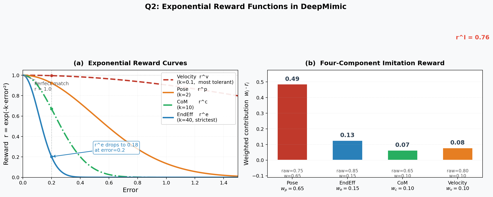
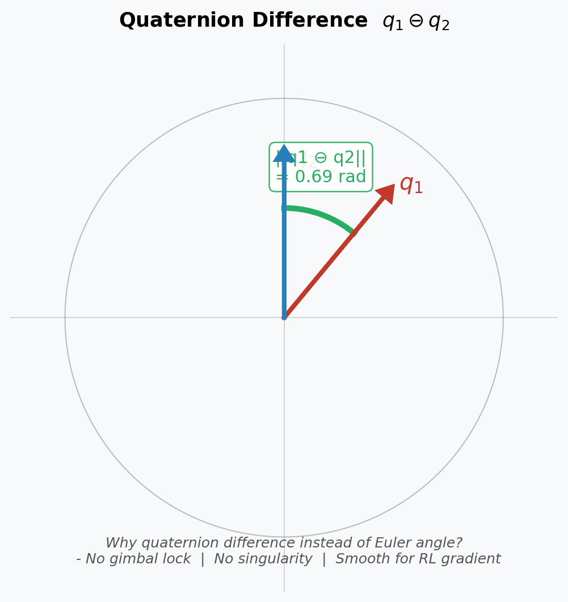

# DeepMimic: Example-Guided Deep RL of Physics-Based Character Skills
**深度模仿：基于示例引导的物理角色技能深度强化学习**

> 📅 阅读日期: -  
> 🏷️ 板块: Reinforcement Learning / Motion Imitation

---

## 📋 基本信息

| 项目 | 链接 |
|------|------|
| **arXiv** | [1804.02717](https://arxiv.org/abs/1804.02717) |
| **PDF** | [下载](https://arxiv.org/pdf/1804.02717) |
| **作者** | Xue Bin Peng, Pieter Abbeel, Sergey Levine, Michiel van de Panne |
| **机构** | UC Berkeley, University of British Columbia |
| **发布时间** | 2018年（SIGGRAPH 2018） |
| **项目主页** | [xbpeng.github.io/DeepMimic](https://xbpeng.github.io/DeepMimic/) |
| **GitHub** | [xbpeng/MimicKit](https://github.com/xbpeng/MimicKit) |

---

## 🎯 一句话总结

DeepMimic 让物理仿真角色通过**模仿动作捕捉数据**来学习技能——给一段人类翻跟斗的动作录像，RL 智能体就能在物理仿真中学会翻跟斗，同时保持物理真实性（不穿模、不悬浮）。

---


## 📌 英文缩写速查
| 缩写 | 全称 | 简单解释 |
|------|------|----------|
| **RL** | Reinforcement Learning | 强化学习 |
| **PPO** | Proximal Policy Optimization | 近端策略优化，DeepMimic 使用的 RL 算法 |
| **GAE** | Generalized Advantage Estimation | 广义优势估计，用于计算策略梯度的优势函数 |
| **RSI** | Reference State Initialization | 参考状态初始化，从参考动作随机时刻初始化 episode |
| **ET** | Early Termination | 提前终止，角色摔倒时结束 episode |
| **MoCap** | Motion Capture | 动作捕捉，记录人体运动数据 |
| **PD Controller** | Proportional-Derivative Controller | 比例-微分控制器，将目标角度转换为关节扭矩 |
| **Stable PD** | Stable Proportional-Derivative Controller | 稳定 PD 控制器（Tan et al. 2011），用隐式积分避免高增益振荡 |
| **DoF** | Degrees of Freedom | 自由度，描述关节可运动的维度数 |
| **CoM** | Center of Mass | 质心，模仿奖励的四维分量之一 |
| **EE** | End-Effector | 末端执行器（手脚），模仿奖励的四维分量之一 |
| **MTU** | Muscle-Tendon Unit | 肌腱单元，一种基于肌肉模型的动作空间 |
| **SGD** | Stochastic Gradient Descent | 随机梯度下降，DeepMimic 使用的优化器 |
| **SIGGRAPH** | Special Interest Group on GRAPHics and Interactive Techniques | ACM 计算机图形学顶会，DeepMimic 发表于此 |
---
## ❓ 这篇论文要解决什么问题？

前面学的 PPO 和 AWR 都是"从零开始"训练策略——机器人自己摸索怎么走路。但这有个大问题：

**纯 RL 训练出来的动作很丑。**

你可能看过 RL 训练的机器人走路视频——它们确实学会了前进，但姿态奇怪：有的像螃蟹一样横着走，有的拖着脚滑行，有的靠抖动前进。这是因为奖励函数只管"前进速度"，不管"像不像人"。

DeepMimic 的解决思路：

> 💡 **类比**：纯 RL 像是告诉孩子"你去那边"，孩子可能爬着去、滚着去。DeepMimic 像是先放一段视频"你看，走路应该这样"，然后孩子照着学——不仅到达目的地，而且姿态好看。

### 之前方法的痛点

1. **纯运动学方法**（动画/轨迹回放）：动作好看但不物理——角色可以穿过地板、悬浮在空中
2. **纯 RL 方法**（PPO 训练走路）：物理真实但动作难看——奖励函数很难精确描述"什么是好看的走路"
3. **传统模仿方法**（tracking controller）：需要手工设计 PD 控制器，换一个动作就要重新调参

DeepMimic 的目标：**用 RL + 动捕参考，同时实现物理真实性和动作自然性。**

---

## 🔧 DeepMimic 是怎么做的？

### 核心思想：模仿奖励 + 任务奖励

DeepMimic 的精髓是一个巧妙的**奖励函数设计**——同时追两个目标：

$$r_t = w^I \cdot r_t^I + w^G \cdot r_t^G$$

- $r_t^I$（Imitation Reward）：**模仿奖励**——动作和参考动捕有多像
- $r_t^G$（Goal Reward）：**任务奖励**——完成了多少任务目标（如前进速度）
- $w^I, w^G$：权重，控制两者的平衡

### 模仿奖励：四个维度衡量"像不像"

模仿奖励由四个部分组成，分别衡量不同层面的相似度：

$$r_t^I = w^p \cdot r_t^p + w^v \cdot r_t^v + w^{ee} \cdot r_t^{ee} + w^{com} \cdot r_t^{com}$$

<table>
  <thead>
    <tr><th>分量</th><th>衡量什么</th><th>计算方式</th></tr>
  </thead>
  <tbody>
    <tr><td>$r^p$（关节姿态）</td><td>每个关节角度是否匹配</td><td>$\exp\left(-2 \sum_j | \hat{q}_{j} - q_{j} |^2\right)$</td></tr>
    <tr><td>$r^v$（关节速度）</td><td>每个关节角速度是否匹配</td><td>$\exp\left(-0.1 \sum_j | \dot{\hat{q}}_{j} - \dot{q}_{j} |^2\right)$</td></tr>
    <tr><td>$r^{ee}$（末端位置）</td><td>手脚位置是否正确</td><td>$\exp\left(-40 \sum_e | \hat{p}_{e} - p_{e} |^2\right)$</td></tr>
    <tr><td>$r^{com}$（质心位置）</td><td>身体重心是否在对的位置</td><td>$\exp\left(-10 | \hat{p}_{com} - p_{com} |^2\right)$</td></tr>
  </tbody>
</table>

其中 $\hat{\cdot}$ 表示参考动捕数据中的值，无 hat 的是仿真角色的实际值。

> 💡 **直觉**：就像给体操运动员打分——关节角度（动作标准度）、速度（节奏感）、末端位置（手脚到位）、重心（整体平衡）都要看。

#### MimicKit 实现：四维模仿奖励计算

代码对应 `mimickit/envs/deepmimic_env.py` 中的 `compute_reward()` 函数：

```python
# mimickit/envs/deepmimic_env.py - compute_reward()
@torch.jit.script
def compute_reward(root_pos, root_rot, root_vel, root_ang_vel, joint_rot, dof_vel, key_pos,
                   tar_root_pos, tar_root_rot, tar_root_vel, tar_root_ang_vel,
                   tar_joint_rot, tar_dof_vel, tar_key_pos,
                   joint_rot_err_w, dof_err_w, track_root_h, track_root,
                   pose_w, vel_w, root_pose_w, root_vel_w, key_pos_w,
                   pose_scale, vel_scale, root_pose_scale, root_vel_scale, key_pos_scale):
    # 1. 姿态奖励 r^p：关节四元数朝向差异
    pose_diff = torch_util.quat_diff_angle(joint_rot, tar_joint_rot)
    pose_err = torch.sum(joint_rot_err_w * pose_diff * pose_diff, dim=-1)
    pose_r = torch.exp(-pose_scale * pose_err)

    # 2. 速度奖励 r^v：关节角速度差异
    vel_diff = tar_dof_vel - dof_vel
    vel_err = torch.sum(dof_err_w * vel_diff * vel_diff, dim=-1)
    vel_r = torch.exp(-vel_scale * vel_err)

    # 3. 质心奖励 r^com：质心位置 + 身体朝向
    root_pos_diff = tar_root_pos - root_pos
    root_pos_err = torch.sum(root_pos_diff * root_pos_diff, dim=-1)
    root_rot_err = torch_util.quat_diff_angle(root_rot, tar_root_rot)
    root_rot_err *= root_rot_err
    root_pose_r = torch.exp(-root_pose_scale * (root_pos_err + 0.1 * root_rot_err))

    # 4. 末端位置奖励 r^ee：手脚位置误差
    if (len(key_pos) > 0):
        key_pos_diff = tar_key_pos - key_pos
        key_pos_err = torch.sum(key_pos_diff * key_pos_diff, dim=-1)
        key_pos_err = torch.sum(key_pos_err, dim=-1)
    else:
        key_pos_err = torch.zeros([0], device=key_pos.device)
    key_pos_r = torch.exp(-key_pos_scale * key_pos_err)

    # 加权求和
    r = pose_w * pose_r \
        + vel_w * vel_r \
        + root_pose_w * root_pose_r \
        + root_vel_w * root_vel_r \
        + key_pos_w * key_pos_r
    return r
```

> 🔑 **代码公式对照**：
> - 论文：$r_t^p = \exp(-2 \sum_j \|\hat{q}_j \ominus q_j\|^2)$
> - 代码：`pose_r = torch.exp(-pose_scale * pose_err)` 其中 `pose_scale = 2`（默认）
> - 四元数差分由 `torch_util.quat_diff_angle()` 实现

### 为什么用指数函数 $\exp(-k \cdot \text{error}^2)$？

- 误差为 0 时，$\exp(0) = 1$（满分）
- 误差越大，奖励指数级衰减趋近于 0
- 这种形式对**小误差宽容**（$e^{-0.01} \approx 0.99$），对**大误差严格**（$e^{-10} \approx 0.00005$）
- 比线性惩罚更平滑，有利于 RL 优化

### 参考状态初始化（RSI）

训练的另一个关键技巧——**Reference State Initialization**：

普通训练：每个 episode 都从站立姿态开始 → 智能体得先学会走到翻跟斗的起始位置，才能开始练翻跟斗  
RSI：每个 episode 从参考动作的**随机时刻**开始 → 智能体可以直接练动作的任何片段

```
参考动作: 助跑 → 起跳 → 空翻 → 落地
          t=0    t=20   t=30   t=50

普通训练: 永远从 t=0 开始 → 前期只能练助跑
RSI:     随机从 t=0/20/30/50 开始 → 每个阶段都能练到
```

> 💡 **RSI 的直觉**：就像学游泳不一定要从"站在池边→跳下去→划水"练起，可以直接从"已经在水里"开始练划水动作。

#### MimicKit 实现：RSI 代码

RSI 的核心在 `_ref_state_init()` 函数，它将角色状态设置为参考动作中随机采样时刻的状态：

```python
# mimickit/envs/deepmimic_env.py - _ref_state_init()
def _ref_state_init(self, env_ids):
    char_id = self._get_char_id()
    
    # 从参考动作获取当前时刻的状态
    self._engine.set_root_pos(env_ids, char_id, self._ref_root_pos[env_ids])
    self._engine.set_root_rot(env_ids, char_id, self._ref_root_rot[env_ids])
    self._engine.set_root_vel(env_ids, char_id, self._ref_root_vel[env_ids])
    self._engine.set_root_ang_vel(env_ids, char_id, self._ref_root_ang_vel[env_ids])
    
    self._engine.set_dof_pos(env_ids, char_id, self._ref_dof_pos[env_ids])
    self._engine.set_dof_vel(env_ids, char_id, self._ref_dof_vel[env_ids])
```

随机时刻采样在 `motion_lib.py` 中实现：

```python
# mimickit/anim/motion_lib.py - sample_time()
def sample_time(self, motion_ids, truncate_time=None):
    phase = torch.rand(motion_ids.shape, device=self._device)  # 均匀采样 phase ∈ [0, 1]
    
    motion_len = self._motion_lengths[motion_ids]
    motion_time = phase * motion_len  # 映射到实际时间
    return motion_time
```

> 🔑 **RSI 核心流程**：`_sample_motion_times()` → `motion_lib.sample_time()` → 均匀采样 phase → `calc_motion_frame()` 获取该时刻的参考状态 → `_ref_state_init()` 将仿真角色设置为该状态

### Early Termination（ET，提前终止）

另一个关键训练技巧——当角色状态明显偏离参考动作时，**直接终止 episode**，不再浪费采样：

**触发条件**：
- 身体非脚部位触地（头、膝盖、躯干碰到地面 = 摔倒了）
- 质心高度低于阈值（已经倒下了）

> 💡 **ET 的直觉**：就像体操比赛，运动员摔倒了裁判不会让他继续翻——已经失败了，赶紧重来。如果不终止，RL 智能体会在"躺在地上扭动"这种无意义状态上浪费大量采样。

**ET + RSI 的配合**：
- **RSI** 让智能体从任意阶段开始练习 → 覆盖面广
- **ET** 在失败时快速终止 → 不浪费时间
- 两者结合：智能体能高效地在各个阶段反复练习，快速迭代

```
无 ET: 摔倒后继续仿真 500 步（全是垃圾数据）→ 浪费算力
有 ET: 摔倒后立刻终止 → 重新开始（RSI随机阶段）→ 高效采样
```

#### MimicKit 实现：ET 代码

```python
# mimickit/envs/deepmimic_env.py - compute_done()
@torch.jit.script
def compute_done(done_buf, time, ep_len, root_rot, body_pos, tar_root_rot, tar_body_pos, 
                 ground_contact_force, contact_body_ids,
                 pose_termination, pose_termination_dist, 
                 global_obs, enable_early_termination,
                 motion_times, motion_len, motion_len_term,
                 track_root):
    done = torch.full_like(done_buf, base_env.DoneFlags.NULL.value)
    
    timeout = time >= ep_len
    done[timeout] = base_env.DoneFlags.TIME.value
    
    motion_end = motion_times >= motion_len
    motion_end = torch.logical_and(motion_end, motion_len_term)
    done[motion_end] = base_env.DoneFlags.SUCC.value

    if (enable_early_termination):
        failed = torch.zeros(done.shape, device=done.device, dtype=torch.bool)

        # 摔倒检测：非脚部位触地（接触力 > 0.1N）
        if (contact_body_ids.shape[0] > 0):
            masked_contact_buf = ground_contact_force.detach().clone()
            masked_contact_buf[:, contact_body_ids, :] = 0
            fall_contact = torch.any(torch.abs(masked_contact_buf) > 0.1, dim=-1)
            has_fallen = torch.any(fall_contact, dim=-1)
            failed = torch.logical_or(failed, has_fallen)

        # 姿态偏离检测
        if (pose_termination):
            body_pos_diff = tar_body_pos - body_pos
            body_pos_dist = torch.sum(body_pos_diff * body_pos_diff, dim=-1)
            body_pos_dist = torch.max(body_pos_dist, dim=-1)[0]
            pose_fail = body_pos_dist > pose_termination_dist * pose_termination_dist
            failed = torch.logical_or(failed, pose_fail)
        
        # 只在第一步之后生效，避免初始状态误判
        not_first_step = (time > 0.0)
        failed = torch.logical_and(failed, not_first_step)
        done[failed] = base_env.DoneFlags.FAIL.value
    
    return done
```

> 🔑 **ET 关键逻辑**：`not_first_step = (time > 0.0)` 确保第一步不会被误判为失败，这是训练初期非常重要的细节。摔倒检测通过 `contact_body_ids` 排除脚部，只检查非脚部位的接触力。

### 训练流程

```
输入: 参考动捕动作 M = {q̂₀, q̂₁, ..., q̂ₜ}

┌──→ ① RSI: 从参考动作的随机时刻 t₀ 初始化仿真角色
│       │
│       ▼
│    ② 运行策略 πθ，在物理仿真中执行动作
│       │
│       ▼
│    ②' ET 检查: 摔倒/严重偏离? ──Yes──→ 终止 episode，回到 ①
│       │No
│       ▼
│    ③ 每步计算模仿奖励: 和参考动捕对比 (关节角+速度+末端+质心)
│       │
│       ▼
│    ④ 用 PPO 更新策略 πθ
│       │
│       ▼
│    收敛? ──Yes──→ 完成 🎉
│       │No
└───────┘
```

---

## 🚶 具体实例：用 DeepMimic 训练后空翻

下面以训练一个仿真人形角色做**后空翻（Backflip）**为例，走一遍完整流程。

### 环境设定（论文原文参数）

| 项目 | 具体值 |
|------|--------|
| **物理引擎** | **Bullet Physics**（不是 MuJoCo！） |
| **仿真频率** | **1200 Hz**（物理步进 1.2kHz） |
| **控制频率** | **30 Hz**（策略每秒查询 30 次） |
| **控制器** | Stable PD Controller（Tan et al. 2011），手动设定增益，所有任务共享 |
| **深度学习框架** | TensorFlow |
| **硬件** | 8 核 CPU，**无 GPU 加速** |

#### MimicKit 实现：主环境类

DeepMimic 的环境实现在 `mimickit/envs/deepmimic_env.py` 的 `DeepMimicEnv` 类中：

```python
# mimickit/envs/deepmimic_env.py
class DeepMimicEnv(char_env.CharEnv):
    def __init__(self, env_config, engine_config, num_envs, device, visualize):
        self._enable_early_termination = env_config["enable_early_termination"]
        self._num_phase_encoding = env_config.get("num_phase_encoding", 0)
        self._reward_pose_w = env_config.get("reward_pose_w")
        self._reward_vel_w = env_config.get("reward_vel_w")
        self._reward_key_pos_w = env_config.get("reward_key_pos_w")
        # ... 四维奖励权重配置
```

> 🔑 **核心结构**：DeepMimicEnv 继承自 CharEnv，持有模仿奖励的四维权重配置 (`reward_pose_w`, `reward_vel_w`, `reward_root_pose_w`, `reward_root_vel_w`, `reward_key_pos_w`)

#### 角色模型参数（Table 1）

| 角色 | Links | 质量(kg) | 身高(m) | DoF | 状态维度 | 动作维度 |
|------|-------|---------|---------|-----|---------|---------|
| **Humanoid** | 13 | 45 | 1.62 | 34 | 197 | 36 |
| **Atlas** | 12 | 169.8 | 1.82 | 31 | 184 | 32 |
| **T-Rex** | 20 | 54.5 | 1.66 | 55 | 262 | 64 |
| **Dragon** | 32 | 72.5 | 1.83 | 79 | 418 | 94 |

- 所有角色建模为**铰接刚体**（articulated rigid bodies）
- 关节类型：大部分是 **3-DoF 球关节**（spherical joint），膝盖和肘部是 **1-DoF 旋转关节**（revolute joint）
- Atlas 质量是 Humanoid 的近 **4 倍**（169.8 vs 45 kg），PD 增益和扭矩限制也不同

#### 训练超参数

| 参数 | 值 |
|------|-----|
| batch size | 4096 samples |
| minibatch size | 256 |
| 折扣因子 γ | 0.95 |
| GAE λ | 0.95 |
| PPO clip ε | 0.2 |
| 学习率（策略，Humanoid/Atlas） | 5×10⁻⁵ |
| 学习率（策略，Dragon/T-Rex） | 2×10⁻⁵ |
| 学习率（价值函数） | 10⁻² |
| 优化器 | SGD with momentum 0.9 |
| 循环技能 episode 长度 | 20s |
| 非循环技能 episode 长度 | 等于动作片段长度 |
| 训练样本量（Humanoid 单技能） | ~**6000 万**样本 |
| 训练时间（Humanoid 单技能） | ~**2 天**（8 核 CPU） |

#### 网络架构

| 层 | 参数 |
|----|------|
| 输入 | 状态特征（197D for Humanoid） |
| 隐藏层 1 | 全连接 **1024** 单元，ReLU |
| 隐藏层 2 | 全连接 **512** 单元，ReLU |
| 输出层 | 线性，维度 = 动作空间（36D for Humanoid） |
| 策略分布 | 高斯分布，均值由网络输出，**固定对角协方差** |
| 价值网络 | 相同结构，输出层 1 维标量 |

> 💡 **关键发现**：
> - 用的是 **Bullet 而非 MuJoCo**！后续很多工作（AMP、ASE）转向了 Isaac Gym
> - **没用 GPU**——2018 年的 RL 训练还是纯 CPU，单个技能就要 2 天
> - 控制频率 30Hz 远低于仿真频率 1200Hz，中间的 40 个物理步都用同一个 PD 目标
> - 协方差矩阵是**固定的**，不是学习的——简化了训练

#### 训练的具体技能和样本量（Table 2 节选）

| 技能 | 动作时长(s) | 训练样本(×10⁶) | 归一化回报 |
|------|-----------|---------------|-----------|
| Backflip | 1.75 | 72 | 0.729 |
| Cartwheel | 2.72 | 51 | 0.804 |
| Walk | 1.26 | 61 | 0.985 |
| Run | 0.80 | 53 | 0.951 |
| Sideflip | 2.44 | 191 | 0.805 |
| Spinkick | 4.42 | 67 | 0.664 |
| Atlas: Backflip | 1.75 | 63 | 0.630 |
| Atlas: Walk | 1.26 | 44 | 0.988 |
| Dragon: Walk | 1.50 | 139 | 0.990 |

> 💡 **从数据看规律**：
> - **简单技能**（Walk 0.985, Run 0.951）回报接近满分，说明模仿效果很好
> - **复杂技能**（Backflip 0.729, Spinkick 0.664）回报较低，说明精确模仿高动态动作更难
> - **Sideflip 需要最多样本**（191M），因为侧翻的动态更复杂
> - **Atlas 比 Humanoid 更难训练**（同样 Backflip：Atlas 0.630 vs Humanoid 0.729），因为质量大了 4 倍

> 💡 **注意动作空间的区别**：PPO 直接输出扭矩，DeepMimic 输出**目标关节角度**，再由底层 Stable PD 控制器计算扭矩。这使得策略输出更像"姿态指令"，学习更容易。

### 第 0 步：准备参考动作

```
动捕数据 (每帧记录所有关节角度):
  帧 0:  [站直，双脚着地]           ← 助跑结束
  帧 5:  [膝盖微弯，准备起跳]       ← 蓄力
  帧 10: [起跳！双脚离地]           ← 离地
  帧 15: [身体后仰，团身]           ← 空中翻转
  帧 20: [继续翻转]                ← 倒立阶段
  帧 25: [展开身体]                ← 准备落地
  帧 30: [双脚着地，站稳]           ← 落地
```

### 第 1 步：RSI 初始化 + 收集经验

```
Episode 1: 从帧 15 开始 (空中团身状态)
  仿真角色被初始化为帧15的姿态和速度
  → 策略尝试控制后续动作
  → 如果成功完成翻转并落地 → 模仿奖励高
  → 如果失败摔倒 → 奖励低，episode 结束

Episode 2: 从帧 0 开始 (站立准备起跳)
  → 策略需要完成整个后空翻流程

Episode 3: 从帧 25 开始 (即将落地)
  → 策略只需学会落地稳定
  ...
```

#### MimicKit 实现：动作库与运动数据加载

运动数据加载在 `MotionLib` 类中实现：

```python
# mimickit/anim/motion_lib.py - MotionLib
class MotionLib():
    def __init__(self, motion_file, kin_char_model, device):
        self._device = device
        self._kin_char_model = kin_char_model
        self._load_motions(motion_file)  # 加载 ASF/AMC 格式动捕数据

    def sample_motions(self, n):
        motion_ids = torch.multinomial(self._motion_weights, num_samples=n, replacement=True)
        return motion_ids

    def calc_motion_frame(self, motion_ids, motion_times):
        # 球面线性插值获取连续姿态
        frame_idx0, frame_idx1, blend = self._calc_frame_blend(motion_ids, motion_times)
        
        root_pos = (1.0 - blend_unsq) * root_pos0 + blend_unsq * root_pos1
        root_rot = torch_util.slerp(root_rot0, root_rot1, blend)  # SLERP 插值
        joint_rot = torch_util.slerp(joint_rot0, joint_rot1, blend_unsq)
```

> 🔑 **SLERP**：球面线性插值（Spherical Linear Interpolation），用于在两个四元数姿态之间平滑过渡，保证旋转插值的几何正确性

### 第 2 步：计算模仿奖励

以某一时刻 $t=15$（空中团身）为例：

```
参考动捕 (帧15):
  右膝角度: q̂ = 2.1 rad (高度弯曲)
  左膝角度: q̂ = 2.0 rad
  质心高度: ĥ = 1.5m (空中)
  ...

仿真角色实际:
  右膝角度: q = 1.8 rad (弯曲不够)
  左膝角度: q = 2.0 rad (完美匹配)
  质心高度: h = 1.3m (偏低)
  ...

模仿奖励计算:
  r_p = exp(-2.0 * [(2.1-1.8)² + (2.0-2.0)² + ...]) = exp(-0.18) ≈ 0.84
  r_v = exp(-0.1 * [速度误差]) ≈ 0.90
  r_ee = exp(-40 * [手脚位置误差]) ≈ 0.75
  r_com = exp(-10 * [(1.5-1.3)²]) = exp(-0.4) ≈ 0.67

  r_I = 0.65×0.84 + 0.1×0.90 + 0.15×0.75 + 0.1×0.67 ≈ 0.82
```

### 第 3 步：PPO 更新

收集一批经验后，用标准 PPO 算法更新策略（和之前学的一样）。
唯一区别是奖励函数变了——不再是"前进速度"，而是"和参考动作像不像"。

#### MimicKit 实现：PPO 训练

PPO 算法实现在 `mimickit/learning/ppo_agent.py`：

```python
# mimickit/learning/ppo_agent.py - PPOAgent
class PPOAgent(base_agent.BaseAgent):
    def _compute_actor_loss(self, batch):
        # PPO 策略损失：clip(ratio) * advantage
        ratio = torch.exp(new_logp - old_logp)
        surr1 = ratio * batch["adv"]
        surr2 = torch.clamp(ratio, 1.0 - self._eps, 1.0 + self._eps) * batch["adv"]
        actor_loss = -torch.min(surr1, surr2)
```

> 🔑 **PPO 核心**：和标准 PPO 一样，通过 clip 机制限制策略更新幅度，避免过度更新导致性能崩溃

### 第 4 步：训练进展

| 阶段 | 迭代 | 表现 |
|------|------|------|
| **初期** | 0-500 | 从各个阶段开始都会摔倒 |
| **学会片段** | 500-2000 | 能完成部分片段（如落地、起跳），但串不起来 |
| **完成全程** | 2000-5000 | 能从头到尾完成后空翻，但有时落地不稳 |
| **精细化** | 5000+ | 后空翻流畅自然，落地稳定 |

> 🔑 **RSI 的威力**：如果没有 RSI，智能体需要先学会助跑、再学起跳、再学翻转、再学落地——每一步都是前一步的前提，学习极慢。RSI 让每个片段独立练习，大大加速。

#### MimicKit 实现：前向运动学

参考动作的姿态计算用到前向运动学，用于获取角色各部位的世界坐标：

```python
# mimickit/anim/kin_char_model.py - KinCharModel
class KinCharModel():
    def forward_kinematics(self, root_pos, root_rot, joint_rot):
        # 根据关节角度计算身体各部位的世界坐标
        # 用于计算末端执行器（手脚）位置和参考角色可视化
```

> 🔑 **作用**：纯运动学计算（无物理仿真），用于获取参考动作中角色各部位的精确位置，供模仿奖励的末端位置项（$r^{ee}$）和参考角色渲染使用

---

## 🤖 DeepMimic 对人形机器人领域的意义

DeepMimic 是**运动模仿学习**的开山之作，几乎所有后续的机器人动作模仿工作都建立在它的框架之上：

1. **定义了模仿奖励的标准范式**：关节姿态 + 速度 + 末端 + 质心的四维奖励函数被广泛沿用
2. **RSI 成为标配**：几乎所有后续的动作模仿工作都使用参考状态初始化
3. **证明了 RL + 动捕的可行性**：之前人们认为复杂技能（空翻、武术）很难通过 RL 学会，DeepMimic 证明了只要有好的参考和奖励设计就可以

### 但它也有明显的局限：

- **一次只能学一个动作**：每个策略只对应一段参考动作，想学 10 个技能就要训 10 个策略
- **奖励函数需要手工设计**：四个分量的权重 $w^p, w^v, w^{ee}, w^{com}$ 需要人工调节
- **不能泛化**：学会了后空翻不代表能侧空翻

> 💡 **路线图视角**：DeepMimic 教你"如何让 RL 智能体模仿一个特定动作"。接下来的 AMP 会解决"如何学习运动风格而不是精确复制每一帧"，PHC 会解决"如何在一个策略中模仿任意动作"。

---

## 🎤 面试高频问题 & 参考回答

### Q1: DeepMimic 的核心创新是什么？
**A**: DeepMimic 的核心创新有两点：① **RSI + ET（参考状态初始化 + 提前终止）**：这是论文消融实验证明的最关键两个组件，使高动态技能（空翻、踢腿）的训练成为可能；② **模仿目标与任务目标联合优化**：将多维度模仿奖励（关节姿态+速度+末端+质心）与任务奖励结合，让智能体既"动作自然"又"目标导向"，同时保留了 RL 对扰动的适应性。

### Q2: 模仿奖励为什么用指数函数形式？
**A**: $\exp(-k \cdot \text{error}^2)$ 有几个好处：① 奖励范围在 $(0, 1]$，方便加权求和；② 对小误差宽容（接近1），对大误差严格（趋近0），梯度平滑；③ 各分量天然不需要归一化就能直接相加。另外，姿态奖励中的关节朝向比较用的是**四元数差分** $q_1 \ominus q_2$（相对旋转位移），而非欧拉角差分，因为四元数不存在万向锁和奇异性问题，更适合 RL 梯度优化。


*左图：不同 k 值的指数奖励曲线，k 越大对误差越严格；右图：四维奖励加权求和示例*


*四元数差分 $q_1 \ominus q_2$ 的几何含义：两个旋转之间的相对位移（弧长 = ||$q_1 \ominus q_2$||），用弧度计量*

### Q3: RSI（参考状态初始化）为什么重要？
**A**: 复杂动作（如空翻）是多个阶段的序列。RSI 在每个 episode 开始时**均匀采样（uniformly sample）**参考动捕中的一个状态作为初始状态，让智能体直接从任意阶段开始练习，而不必按顺序依次学会前置阶段才能进入后续阶段——这大幅加速了高动态动作的学习。对于循环技能，相位 $\phi$ 在每个 cycle 结束时重置为 0；对于非循环技能，episode 长度等于动作片段长度。

### Q4: Early Termination 在 DeepMimic 中起什么作用？
**A**: 当躯干或头部接触地面、或某 link 低于高度阈值时，终止 episode。作用有三：① 避免在已摔倒状态上浪费采样；② 隐式惩罚摔倒——摔倒后后续奖励归零，策略被迫学会保持平衡；③ 本质上是一种**数据分布裁剪机制**，防止训练早期大量"角色在地上挣扎"的数据污染网络，使采样集中于有意义的动作状态。ET 和 RSI 配合，实现高效的多阶段训练。

### Q5: DeepMimic 和纯 PPO 训练走路有什么区别？
**A**: 论文 Table 4 的消融实验给出了直接证据：Strike 任务仅有模仿奖励时成功率 19%，两者都有时 99%；Throw 任务两者都有时 75%，仅有模仿奖励时仅 5%。这说明两点：① **单纯模仿不足以完成任务**，策略需要任务目标才能有效导向；② **没有模仿则动作不自然**，纯任务奖励下角色会发展出怪异但功能性策略（如抱着球跑而非扔球）。DeepMimic 的价值在于两者的平衡。

### Q6: DeepMimic 的局限性？后续工作怎么解决？
**A**:
- **一策略一动作** → AMP/ASE 引入风格学习和技能嵌入，一个策略学多个技能
- **精确帧匹配** → AMP 用对抗学习匹配运动分布而非逐帧对比
- **不能泛化** → PHC 引入通用运动跟踪框架
- **Phase 变量线性限制** → Phase 变量随时间线性推进，无法自适应调整动作节奏 → 限制了扰动恢复的自然性
- **多 Clip 规模受限** → Multi-clip reward 适合相似类型的动作混搭（如多种走路），混合差异大的动作（如 sideflip + frontflip）会导致策略只模仿部分 clip → 需用 Composite Policy 解决
- **PD 增益需手动调整** → 不同角色 morphology 需要不同 PD 控制器参数

### Q7: 为什么 DeepMimic 能抗干扰？RSI+ET 消融实验说明了什么？
**A**:
论文做了完整的消融实验（Section 10.4），证明 RSI 和 ET 都是关键组件：

| 技能 | RSI + ET | 仅 ET | 仅 RSI |
|------|---------|-------|--------|
| Backflip | **0.791** | 0.730 | 0.379 |
| Sideflip | **0.823** | 0.717 | 0.355 |
| Spinkick | **0.848** | 0.858 | 0.358 |
| Walk | **0.980** | 0.981 | 0.974 |

**关键发现**：
- 对高动态技能（Backflip/Sideflip），**仅用 RSI 而不用 ET 会导致严重失败**（0.379/0.355）——因为角色会在地上挣扎浪费采样，class imbalance 问题严重
- 对简单技能（Walk），ET 影响不大，因为角色很少摔倒
- RSI 对高动态技能尤为重要：没有 RSI，Backflip 策略只学会了"小幅向后跳"而非完整空翻

抗干扰能力测试（Table 6）：Run 策略可承受 **720N·0.2s** 前向推动，Spinkick 可承受 **600N** 侧向推动，与 SAMCON 相当。

### Q8: 不同角色之间策略能直接迁移吗？为什么？
**A**:
**不能直接迁移**。论文做了人形→Atlas 的迁移实验：
- 直接把 Humanoid 策略用于 Atlas：Run = 0.013，Backflip = 0.014（几乎为 0）
- 用 Atlas 单独训练后：Run = 0.846，Backflip = 0.630

**原因**：Atlas 质量是 Humanoid 的 **~4 倍**（169.8kg vs 45kg），质量分布完全不同，同样的动作策略在两个角色上产生的动力学差异巨大。迁移需要重新训练，但**动捕数据的姿态可以直接复制**（论文直接复制 local joint rotations），只需重新训练策略。

### Q9: Composite Policy 怎么让角色自主切换技能？
**A**:
不是让一个策略同时学多个技能，而是**分别训练多个单技能策略**，推理时用**价值函数做 Boltzmann 选策略**：

$$\Pi(a \mid s) = \sum_i p_i(s) \pi^i(a \mid s), \quad p_i(s) = \frac{\exp V^i^i(s)/T}{\sum_j \exp V^j(s)/T}$$

其中 $T=0.3$ 是温度参数。值函数大的策略被选概率高。角色在每个 cycle 结束时重新采样新技能，通过值函数估计自动选择合适的过渡，无需手工设计转换逻辑。摔倒时自动触发 getup 策略。

### Q10: Vision-based 任务怎么处理地形感知？
**A**:
对于需要视觉的地形穿越任务，策略输入额外加入了**高度图 H**（Heightmap）：
- 卷积层处理：3 层卷积（16×8×8 → 32×4×4 → 32×4×4），最后接 64 个全连接单元
- 高度图 + 状态 + 目标拼接后送入主网络（1024→512）
- 训练采用**两阶段渐进学习**：先在平地训练纯模仿策略，再加入高度图在地形上微调
- 1D 高度场（100 samples，跨 10m）用于线性障碍环境；2D 32×32 高度图用于弯曲平衡木

---

## 📎 附录

### A. 状态和动作空间详解

**状态空间**包含两部分：
- **角色自身状态**：所有关节的旋转角度（四元数）、角速度、质心位置和速度
- **参考动作相位** $\phi_t$：表示当前在参考动作中的进度（0~1），让策略知道"现在该做到哪一步了"

**动作空间**：目标关节角度（由 PD 控制器转为扭矩）
- 与 PPO 直接输出扭矩不同，DeepMimic 输出的是**目标姿态**
- PD 控制器：$\tau = k_p (\hat{q} - q) + k_d (\hat{\dot{q}} - \dot{q})$
- 好处：策略只需关心"摆什么姿势"，底层稳定性由 PD 保证

### B. 模仿奖励权重参考值

> ⚠️ **重要说明**：以下所有数值均来自论文原文（Peng et al. 2018, arXiv:1804.02717），是**作者调优后的经验性固定值**，而非理论推导。这些本质上是超参数，论文默认使用这套值，不同任务或不同角色时可以调整。

#### 奖励函数完整结构

总体奖励由模仿目标与任务目标加权组成：

$$r_t = \omega_I \cdot r_t^I + \omega_G \cdot r_t^G$$

其中 $\omega_I = 0.7$（模仿权重），$\omega_G = 0.3$（任务权重），论文明确说明：

> *"The weights for the imitation and task objectives are set to $\omega_I = 0.7$ and $\omega_G = 0.3$ **for all tasks**."*

#### 模仿奖励四维分量

$$r_t^I = w_p \cdot r_t^p + w_v \cdot r_t^v + w_e \cdot r_t^e + w_c \cdot r_t^c$$

| 分量 | 含义 | 权重 $w$ | k 值（指数敏感度） | 说明 |
|------|------|---------|------------------|------|
| $r^p$（pose） | 关节四元数朝向匹配 | $w_p = 0.65$ | **k = 2** | 最重要，决定动作整体正确性 |
| $r^v$（velocity） | 关节角速度匹配 | $w_v = 0.1$ | **k = 0.1** | 保证节奏感，对误差最宽容 |
| $r^e$（end-effector） | 手脚 3D 位置匹配 | $w_e = 0.15$ | **k = 40** | 精度要求最高 |
| $r^c$（center-of-mass） | 质心位置偏移惩罚 | $w_c = 0.1$ | **k = 10** | 整体平衡 |

#### k 值的物理含义

k 值决定了该分量对误差的敏感程度——**k 越大，对误差越严格**：

| k 值大小 | 含义 |
|---------|------|
| k = 40（末端） | 手脚位置稍有偏差 reward 就急剧下降，精度要求最高 |
| k = 10（质心） | 质心偏差容忍度适中 |
| k = 2（姿态） | 关节朝向误差容忍度较好 |
| k = 0.1（速度） | 对速度误差最宽容，因为速度本身有随机性 |

### C. 与路线图其他论文的关联

| 关系 | 说明 |
|------|------|
| **PPO → DeepMimic** | DeepMimic 用 PPO 作为 RL 优化器，改了奖励函数 |
| **DeepMimic → AMP** | AMP 用对抗学习替代手工模仿奖励 |
| **DeepMimic → PHC** | PHC 在 DeepMimic 基础上实现通用运动跟踪 |
| **DeepMimic → ASE** | ASE 将模仿学到的技能编码为可组合的潜空间 |

### D. 完整超参数速查表

| 参数 | 含义 | 值 |
|------|------|--------|
| **物理引擎** | 仿真环境 | Bullet Physics |
| **仿真频率** | 物理步进频率 | 1200 Hz (1.2kHz) |
| **控制频率** | 策略查询频率 | 30 Hz |
| **控制器** | 底层扭矩控制 | Stable PD (Tan et al. 2011) |
| $\omega_I$（模仿目标权重） | 模仿奖励在总体奖励中的占比 | 0.7 |
| $\omega_G$（任务目标权重） | 任务奖励在总体奖励中的占比 | 0.3 |
| $w_p$（姿态权重） | 关节朝向在模仿奖励中的占比 | 0.65 |
| $w_v$（速度权重） | 关节速度在模仿奖励中的占比 | 0.1 |
| $w_e$（末端权重） | 末端位置在模仿奖励中的占比 | 0.15 |
| $w_c$（质心权重） | 质心位置在模仿奖励中的占比 | 0.1 |
| batch size | PPO 采样批次 | 4096 |
| minibatch size | 梯度更新子批次 | 256 |
| $\gamma$（折扣因子） | TD 折扣 | 0.95 |
| $\lambda$（GAE） | 广义优势估计 | 0.95 |
| $\epsilon$（PPO clip） | 截断阈值 | 0.2 |

### E. DeepMimic 能学会的技能

论文展示了多种技能：
- **运动类**：走路、跑步、翻跟斗（前空翻、后空翻）、侧手翻
- **格斗类**：旋风踢、刺拳
- **杂技类**：跳舞、翻滚
- 全部在物理仿真中完成，具有真实的接触和碰撞

### F. 策略输出的动作 $a$ 到底是什么？

#### 结论：输出的是 PD 控制器的**目标关节角度**，不是力矩

论文原文（Section 5.1 States and Actions）明确写道：

> *"The action a from the policy specifies **target orientations for PD controllers** at each joint."*

**完整控制流**：

```
策略网络 π(s)
    │
    │ 输出: 目标关节角度 â = {â₁, â₂, ..., âₙ}
    │       → 30 Hz 输出一次
    ▼
Stable PD 控制器
    │
    │ 计算扭矩: τⱼ = kₚ(âⱼ - qⱼ) + k_d(â̇ⱼ - q̇ⱼ)
    │       → 1200 Hz 计算扭矩
    ▼
Bullet 物理引擎
    │ 施加扭矩 τ，仿真刚体动力学
    ▼
新状态 s'
```

### G. Multi-Clip Reward：多剪辑模仿与技能组合

#### 方法一：Multi-Clip Reward（多剪辑奖励）

$$r_t^I = \max_{j=1, \ldots, k} \left( r_t^{I, (j)} \right)$$

策略在每一步自动选择**当前最匹配的那段剪辑**作为目标。

#### 方法二：Skill Selector（技能选择器）

给策略输入一个 **one-hot 向量** $\delta_t \in \{0,1\}^k$，明确告诉它"现在应该执行哪个动作"。

#### 方法三：Composite Policy（复合策略）

分别训练多个单技能策略，推理时用**价值函数做 Boltzmann 选策略**：

$$\Pi(a \mid s) = \sum_{i=1}^{k} p_i(s) \cdot \pi^i(a \mid s)$$

$$p_i(s) = \frac{\exp(V^i(s) / T)}{\sum_{j=1}^{k} \exp(V^j(s) / T)}$$

| | Multi-Clip Reward | Skill Selector | Composite Policy |
|---|---|---|---|
| **训练策略数** | 1 | 1 | k（每个技能独立训） |
| **用户控制** | ❌ 隐式自主 | ✅ one-hot 显式指定 | ✅ 价值调度/显式指定 |
| **新增技能成本** | 重新训练 | 重新训练 | ✅ 直接加入技能库 |

---

### I. Flashcards 复习卡片

| # | 问题 | 答案 |
|---|------|------|
| 1 | DeepMimic 框架的核心目标是什么？ | 结合数据驱动的行为规范与物理模拟，使模拟角色在模仿参考动作的同时能对环境变化做出真实反应。 |
| 2 | DeepMimic 系统主要由哪三个输入组成？ | 角色模型、对应的运动捕捉参考剪辑以及由奖励函数定义的任务。 |
| 3 | 在策略网络中，相位变量 $\phi$ 的作用是什么？ | 表示参考运动的时间进度，取值在 $[0, 1]$ 之间，用于处理随时间变化的动作目标。 |
| 4 | DeepMimic 策略输出的动作 $a$ 具体代表什么？ | 为角色每个关节的比例微分 (PD) 控制器指定的各目标角度或方向。 |
| 5 | 角色状态 $s$ 的特征是在哪个坐标系下计算的？ | 以角色的根节点（盆骨）为原点、x 轴为朝向的局部坐标系。 |
| 6 | 总奖励函数 $r_t$ 由哪两项加权求和组成？ | 模仿奖励 $r_t^I$ 和任务奖励 $r_t^G$。 |
| 7 | 模仿奖励 $r_t^I$ 包含哪四个子分量？ | 姿态奖励 $r^p$、速度奖励 $r^v$、末端执行器奖励 $r^e$ 和质心奖励 $r^c$。 |
| 8 | 姿态奖励 $r^p$ 是如何衡量模仿准确度的？ | 计算模拟角色与参考运动之间各关节旋转四元数的差异。 |
| 9 | 速度奖励 $r^v$ 的计算依据是什么？ | 模拟角色关节角速度与通过参考运动有限差分获得的目标角速度之间的差异。 |
| 10 | 末端执行器奖励 $r^e$ 关注角色身体的哪些部位？ | 双手和双脚在世界坐标系中的位置。 |
| 11 | 质心奖励 $r^c$ 的主要目的是什么？ | 惩罚模拟角色的质心位置与参考运动质心位置之间的偏差。 |
| 12 | DeepMimic 采用哪种深度强化学习算法来训练策略？ | 近端策略优化算法 (PPO)。 |
| 13 | 什么是参考状态初始化 (RSI)？ | 在每个训练回合开始时，从参考运动中随机采样一个状态作为智能体的初始状态。 |
| 14 | 为什么 RSI 对学习后空翻等高动态动作至关重要？ | 它允许智能体直接接触高奖励的中间状态，避免了因必须先学会起跳才能发现翻转奖励而导致的探索困难。 |
| 15 | 什么是提前终止 (ET) 机制？ | 当角色发生跌倒（如躯干或头部触地）时，立即停止当前的训练回合。 |
| 16 | 提前终止 (ET) 如何辅助解决训练中的数据分布不均问题？ | 通过终止失败的回合，减少网络学习角色在地面挣扎等无效状态的负担，使采样集中在有效动作上。 |
| 17 | 多剪辑奖励 (Multi-Clip Reward) 是如何从多个参考动作中提取奖励的？ | 使用 $max$ 操作符取所有参考剪辑中模仿奖励最高的一个。 |
| 18 | 技能选择器 (Skill Selector) 策略通过什么方式让用户触发不同技能？ | 输入一个 one-hot 编码的向量目标 $g_t$ 来指定当前应执行的动作剪辑。 |
| 19 | 复合策略 (Composite Policy) 如何在运行时自动选择执行哪种技能？ | 利用各独立策略的价值函数 $V(s)$，按玻尔兹曼分布采样选择预期回报最高的策略。 |
| 20 | 在目标航向任务中，任务奖励 $r^G$ 如何定义？ | 奖励角色质心速度在目标方向上的分量，惩罚速度低于设定阈值的情况。 |

### J. 质量矩阵 $M(q)$ 与关节等效质量

#### 从牛顿第二定律到广义坐标

单个质点的牛顿第二定律： $F = ma$ ， $m$ 是质量标量。

对于铰接多体系统（如 DeepMimic 的人形角色），运动方程写成**广义坐标**（关节角度）的形式：

$$M(q) \cdot \ddot{q} = \tau + f_{ext}$$

其中：
- $q$ ：关节角度向量
- $\ddot{q}$ ：关节角加速度
- $\tau$ ：关节扭矩
- $M(q)$ ： $n \times n$ 的**质量矩阵**（也叫惯性矩阵）， $n$ 是关节自由度数

#### 为什么是矩阵而非标量？

因为**一个关节转动时，不只是带动它直接连接的肢体，还会影响所有下游肢体的运动**。

$M(q)$ 的每个元素含义：

| 元素 | 含义 |
|------|------|
| $M_{ii}$（对角线） | 第 $i$ 个关节**独立转动**时需要克服的等效转动惯量 |
| $M_{ij}$（非对角线） | 第 $j$ 个关节转动时，对第 $i$ 个关节产生的**耦合惯性力** |

#### 和 Stable PD 的关系

在 Stable PD 中：

$$A = M + \Delta t \cdot k_d + \Delta t^2 \cdot k_p$$

- **单关节**： $M$ 退化为标量 → 直接除
- **整个角色**： $M$ 是 $n \times n$ 矩阵 → 需要解线性方程组

> 🔑 **一句话**：质量矩阵就是"关节版"的牛顿第二定律中的 $m$——多关节系统中，每个关节的 $m$ 不仅取决于自己，还取决于它带动的所有下游肢体，且随姿态变化。

---

## 📁 MimicKit 关键文件速查

> 📍 MimicKit 代码库路径：`/home/chong/Desktop/project/MimicKit`

| 功能 | 文件路径 |
|------|---------|
| 主环境 | `mimickit/envs/deepmimic_env.py` |
| 运动库 | `mimickit/anim/motion_lib.py` |
| 角色模型 | `mimickit/anim/kin_char_model.py` |
| PPO Agent | `mimickit/learning/ppo_agent.py` |
| 工具函数 | `mimickit/util/torch_util.py` |
| 物理引擎接口 | `mimickit/engines/engine.py` |

### 快速定位命令

```bash
# 搜索 RSI 实现
grep -r "ref_state_init" /home/chong/Desktop/project/MimicKit/mimickit/

# 搜索奖励计算
grep -r "compute_reward" /home/chong/Desktop/project/MimicKit/mimickit/

# 搜索提前终止
grep -r "early_termination\|has_fallen\|pose_fail" /home/chong/Desktop/project/MimicKit/mimickit/

# 搜索四元数差分
grep -r "quat_diff_angle" /home/chong/Desktop/project/MimicKit/mimickit/
```

---

## 💬 讨论记录

> 待补充
