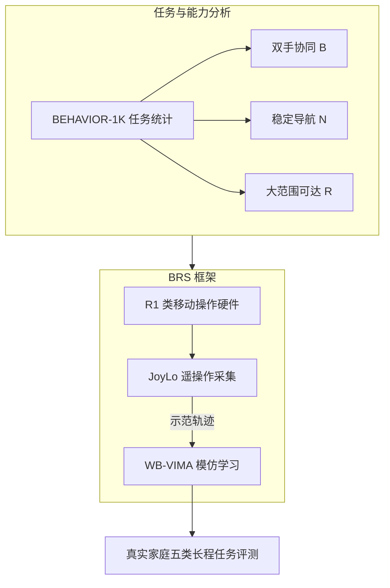

# BEHAVIOR Robot Suite: Streamlining Real-World Whole-Body Manipulation for Everyday Household Activities
**BEHAVIOR Robot Suite：面向日常家务的实机全身操作框架（BRS）**

> 📅 阅读日期: 2026-05-16
> 🏷️ 板块: 03_High_Impact_Selection / Simulation Platform & Tools
> 🧭 状态: 首版摘要（含 mermaid）；与 BEHAVIOR-1K 任务族对齐，侧重 JoyLo + WB-VIMA 两条主线。

---

## 📋 基本信息

| 项目 | 链接 |
|------|------|
| **arXiv** | [2503.05652](https://arxiv.org/abs/2503.05652) |
| **HTML** | [arxiv.org/html/2503.05652](https://arxiv.org/html/2503.05652) |
| **PDF** | [arxiv.org/pdf/2503.05652.pdf](https://arxiv.org/pdf/2503.05652.pdf) |
| **项目主页** | [behavior-robot-suite.github.io](https://behavior-robot-suite.github.io/) |
| **算法代码（WB-VIMA 等）** | [behavior-robot-suite/brs-algo](https://github.com/behavior-robot-suite/brs-algo) |
| **硬件与遥操作（JoyLo / 控制栈）** | [behavior-robot-suite/brs-ctrl](https://github.com/behavior-robot-suite/brs-ctrl) |
| **会议** | CoRL 2025 |
| **作者** | Yunfan Jiang, Ruohan Zhang, Josiah Wong, Chen Wang, Yanjie Ze, Hang Yin, Cem Gokmen, Shuran Song, Jiajun Wu, Li Fei-Fei 等（Stanford） |
| **硬件平台** | Galaxea R1：全向移动底盘 + 双臂 + 4-DoF 躯干（论文中 BRS 默认 embodiment） |

---

## 🎯 一句话总结

论文从 [BEHAVIOR-1K](https://behavior.stanford.edu/behavior-1k) 的千级家务任务中归纳出**双手协同、稳定精确导航、末端大范围可达**三类全身能力需求，并提出 **BRS**：用低成本 **JoyLo** 全身遥操作高效采集示范，再用 **WB-VIMA** 在彩色点云 + 本体感知上学习自回归、分层解码的全身视觉运动策略，在真实家庭场景中完成多类长程任务。

---

## 📌 流程概览（mermaid）

---

## 🔧 方法详解

### JoyLo 全身遥操作

在低成本「运动学孪生」双臂末端安装 Joy-Con：拇指杆控制全向底盘与躯干姿态、扳机控制夹爪；Leader 臂与机器人臂关节耦合，并用 PD 式力矩把 follower 状态拉回 leader，形成可感知的双向力反馈。论文给出单套 **500 美元**量级的 BoM 与装配指引（见项目文档）。

### WB-VIMA 策略学习

用 Transformer 将彩色点云（PointNet 编码）与本体状态编码为 visuomotor token 序列，经因果自注意力融合多步观测。动作头以**分层自回归**顺序展开：底盘 → 躯干 → 双臂与夹爪；每一支路使用扩散式噪声预测网络，训练目标为预测注入噪声（标准扩散损失）。控制频率上数据约 10 Hz、底层控制器 100 Hz，策略每 0.1 s 更新一次并重复执行若干步（详见论文实验设置）。

---

## 🏠 实验与工程印象

- 五类任务覆盖置物、清洁卫生间、整理衣物、派对后收拾、倒垃圾等，强调**长距离导航、关节型/可变形物体、狭窄空间**等额外难点。
- 与 DP3、RGB-DP、ACT 等基线对比时，论文强调「显式 3D 点云 + 全身层次解码」对安全违规率与长程成功率的贡献；具体数值与消融以论文图表为准。

---

## 🔗 与仓库内其它笔记的关系

- 与 **HumanoidBench**（仿真基准）、**Humanoid-Gym**（人形 RL 训练栈）互补：BRS 侧重**真机全身家务**的数据接口与学习管线开源。
- 下一轮「高影响力精选 · 三轨」回到 **全身控制核心** 时，下一篇待补笔记候选为 **H4 HugWBC**（参见 `papers/DAILY_SUMMARY_LOG.md`）。
