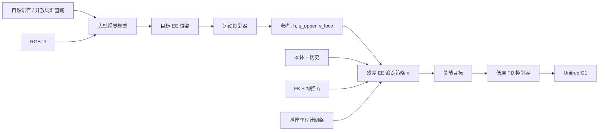

# HERO: Learning Humanoid End-Effector Control for Open-Vocabulary Visual Loco-Manipulation
**HERO：基于开放词汇视觉引导的人形机器人末端执行器控制**

> 📅 阅读日期: 2026-04-21
>
> 🏷️ 板块: 04 Loco-Manipulation · 开放词汇操作 · 残差末端追踪
>
> 🧭 状态: 深度技术细节已填充（基于 arXiv:2602.16705 + 项目页）

---

## 📋 基本信息

| 项目 | 链接 |
|------|------|
| **arXiv** | [2602.16705](https://arxiv.org/abs/2602.16705) |
| **PDF** | [Download](https://arxiv.org/pdf/2602.16705.pdf) |
| **作者** | Runpei Dong*, Ziyan Li*, Xialin He, Saurabh Gupta |
| **机构** | University of Illinois Urbana-Champaign (UIUC) |
| **发布时间** | 2026-02 |
| **项目主页** | [hero-humanoid.github.io](https://hero-humanoid.github.io/) |
| **代码** | 🚧 Coming Soon（作者主页标注） |
| **实验平台** | Unitree G1 人形机器人 + 机载 RGB-D |

---

## 🎯 一句话总结

HERO（**H**umanoid **E**nd-effector cont**RO**l）用**仿真训练的残差感知全身 EE 追踪策略**（IK + 神经正运动学/基座里程计 + 目标调整 + 重规划）把末端误差压到约 **2.5 cm**，再与**开放词汇大视觉模型**模块化组合，在办公室/咖啡店等 novel 场景对 mug、apple、toy 等开放词汇物体实现 **~84%** 抓取成功率——**无需人类遥操作示教**。

---

## 📌 英文缩写速查

| 缩写 | 全称 | 简单解释 |
|------|------|----------|
| **EE** | End-Effector | 末端执行器（G1 灵巧手/夹爪） |
| **FK** | Forward Kinematics | 正运动学：关节角 → 末端位姿 |
| **IK** | Inverse Kinematics | 逆运动学：末端目标 → 关节参考轨迹 |
| **LVM** | Large Vision Model | 开放词汇检测/分割大模型 |
| **OWV** | Open-Vocabulary | 可用自然语言描述任意物体 |
| **RGB-D** | Color + Depth | 彩色 + 深度相机输入 |

---

## ❓ 论文要解决什么问题？

### 1. 野外 loco-manipulation 的两难

在真实环境中"边走边抓任意物体"需要：

- **精确的末端执行器（EE）控制**（全身动态下毫米-厘米级追踪）
- **可泛化的场景理解**（novel 物体、novel 布局）

纯**真实世界模仿学习**数据难采集、难覆盖开放集物体；纯**仿真 RL** 又难把开放词汇语义与全身控制接起来。

### 2. 低成本人形上 FK/里程计不准

Unitree G1 等平台上：

- 解析 **FK** 与真实 EE 位姿存在系统偏差（连杆柔性、标定误差）
- **基座里程计**在行走中漂移
- 传统 IK 轨迹在动态下半身运动时误差累积 → 抓取失败

### 3. 端到端大模型 vs 模块化

端到端 VLA 难保证动态行走中的 EE 精度；HERO 选择 **"强视觉泛化（大模型）+ 强控制（仿真策略）"** 解耦。

> 💡 **范式**：不收集人类全身示教，而在仿真里把 EE 追踪练到足够准，再用开放词汇视觉模块提供目标位姿——把数据瓶颈从"机器人轨迹"换成"仿真控制质量"。

---

## 🔧 方法详解

### 系统总览（模块化三件套）

```
开放词汇视觉 (RGB-D + LVM) → 目标物体 3D 位姿 / 语言查询
        ↓
运动规划器 → 全身参考轨迹（基座高度 + 上肢关节 + 步态指令）
        ↓
残差感知 EE 追踪策略 π（仿真 RL 训练）→ 关节目标 → 低层 PD
```

### 1. 开放词汇视觉感知

- 输入：**机载 RGB-D**
- 用大型视觉模型做 **open-vocabulary 检测/定位**（论文强调强视觉泛化，项目页展示 "purple book"、"Starbucks coffee" 等文本查询）
- 输出：目标物体在机器人坐标系下的 **6D 抓取位姿**（或等价 EE 目标）
- **无需**针对每类物体收集机器人示教

**工程含义**：感知可随 LVM 升级而替换，控制栈保持稳定。

### 2. 残差感知全身 EE 追踪策略（核心）

#### 2.1 残差表述

策略不直接输出绝对关节角，而是学习在**规划器参考**之上的修正。定义 EE 位姿误差（机器人坐标系）：

\[
\Delta E_t = f_{EE}(x_t) \ominus ee_t
\]

其中 \(ee_t\) 为目标 EE 位姿，\(f_{EE}(x_t)\) 为**校正后**的当前 EE 位姿，\(\ominus\) 为位姿差。

**策略输入**（典型）：

| 输入 | 含义 |
|------|------|
| \(s_t\) | 本体感受（关节、IMU 等） |
| \(h_t\) | 参考基座高度 |
| \(q_t\) | 参考上肢关节角 |
| \(v_t\) | 行走速度指令 |
| 历史 \((s,a)\) | 短时序上下文 |
| \(\Delta E_t\) | 当前 EE 残差（闭环关键） |

**架构**：**双 MLP** 解耦上半身追踪与下半身 locomotion，避免梯度互相拖累。

#### 2.2 IK 参考轨迹生成

规划器给出 EE 目标后，用 **IK** 将残差修正后的目标转为**参考关节轨迹** \(q^{\text{ref}}_t\)，再由 RL 策略输出最终关节目标/力矩。

#### 2.3 残差神经正运动学模型 \(\eta\)

解析 FK 不准，故学习校正：

\[
f_{EE}(x_t) = FK(x_t) \oplus \eta\bigl(x_t,\, FK(x_t)\bigr)
\]

- \(x_t\)：手臂 + 腰部相关关节状态
- \(\eta\)：**3 层 MLP**，输出残差平移 + **6D 连续旋转**残差
- \(\oplus\)：位姿复合

在仿真中监督学习，弥补 sim-to-real 与建模误差。

#### 2.4 基座里程计神经模型

行走导致目标在机体坐标系下"漂移"。第二个网络从本体状态估计**脚-relative 基座位姿**，与 EE 模型配合做 **goal adjustment**（按追踪表现微调目标，抵消系统偏差）。

#### 2.5 重规划（Replanning）

每隔 \(k=300\) 控制步（50 Hz 下约 **6 s**）用运动规划器**重算参考轨迹**，抑制累积漂移，把学生策略输入保持在训练分布内。对**移动物体**，项目页展示可依赖视觉**触发重规划**。

### 3. 训练与仿真

- **EE 追踪策略**：仿真 RL 训练（论文与 UIUC 人形控制惯例一致，强调大规模并行仿真）
- **神经 FK / 里程计**：仿真监督学习
- **视觉模块**：预训练 LVM，推理时冻结或轻量微调（论文定位为模块化）
- **无需**真实人类全身演示即可完成抓取栈

---

## 🧭 整体流程（mermaid）



---

## 🚶 具体实例

### 实例 A：咖啡店 — "Starbucks coffee"

1. 用户文本指定目标；LVM 在 RGB-D 中定位杯子
2. 规划器生成靠近桌面的行走 + 伸手参考
3. 行走中 \(\eta\) 校正 EE 位姿，策略闭环追踪 \(\Delta E_t\)
4. 成功抓取并抬离 **43–92 cm** 高度范围内的桌面

### 实例 B：杂乱桌面 — "chip can"

多个干扰物共存；开放词汇检测选中目标罐体，规划路径避障，残差追踪保证接触前 EE 对准。

### 实例 C：移动物体 — 视觉重规划

目标轻微移动时，视觉更新 3D 位姿 → 触发重规划 → 新参考轨迹，避免纯开环抓取失败。

### 实例 D：扩展 — 冰箱门把手

同一 EE 追踪栈可扩展到**先抓取把手再拉门**的长接触任务（项目页 door opening demo）。

---

## 🧪 实验与结果要点

### 仿真 EE 追踪精度（论文报告）

| 方法 | 平均 EE 平移误差 |
|------|------------------|
| **HERO** | **2.48 cm** |
| AMO | 8.29 cm |
| FALCON | 13.57 cm |

→ 相对基线约 **3.2×** 误差降低（摘要与项目页一致）。

### 开放词汇抓取（novel 环境）

- 端到端开放词汇抓取成功率约 **83.8%**
- 桌面高度 **43 cm – 92 cm**
- **10 类日常物体**（苹果、可乐罐、橄榄油瓶、游戏卡带等）多 trial
- 场景含 **办公室、咖啡店、厨房、教室、实验室** 等

### 消融（定性重要性）

| 移除组件 | 影响 |
|----------|------|
| 神经正运动学 \(\eta\) | 跟踪误差显著上升（综述报道约 +40% 量级） |
| Goal adjustment | 成功率下降（约 −25% 量级） |
| Replanning | 长时域漂移与扰动恢复变差 |

### 失败模式（项目页）

- 物体滑落、高桌下手臂卡住
- 毛绒/重物抓取不稳定
- **Walk-and-grasp**：第一视角 FOV 有限，需走近才能看见目标

---

## 🏗️ 工程复现要点

1. **先模块化验收**：单独测 EE 追踪（仿真曲线到 2–3 cm）再接 LVM
2. **FK 不可信就残差化**：\(\eta(x, FK(x))\) 是 G1 级平台的关键 trick
3. **重规划周期**：\(k=300\) @ 50 Hz 是默认节奏；动态场景缩短周期
4. **双 MLP 解耦**：上肢追踪与下肢行走分开训/推理，减轻干扰
5. **感知可插拔**：换更强的 open-vocabulary 模型即可升级语义，无需重训全身策略
6. **数据策略**：控制侧靠仿真；视觉侧靠互联网预训练——避开大规模人形遥操作数据集

---

## 🤖 工程价值

- **开放集操作**：文本指定 "purple book" 即可尝试抓取，适合家庭/服务场景
- **仿真→真实桥接**：残差 FK + 重规划模板可复用到其他人形平台
- **与 ULTRA / Ψ₀ 互补**：HERO 强调**模块化 EE 精度**；基础模型路线强调端到端 latent；可层级组合

---

## 🤔 局限性

- 主要验证 **刚性、中小尺寸** 物体；可变形/铰接物体仍难
- 高度范围 43–92 cm，地面/头顶操作未覆盖
- 代码尚未发布；复现需等待官方仓库
- 双手协调、强力接触操作（拧盖等）未主打

---

## 🎤 面试高频问题 & 参考回答

1. **HERO 为什么不用端到端 VLA 一把梭？**
   - 动态行走中 EE 误差是厘米级瓶颈；把"看得懂"（LVM）和"够得着"（仿真追踪策略）拆开，各自做到极限再组合。

2. **3.2× 误差下降来自哪里？**
   - 残差闭环 + 学习 FK 校正 + 基座里程计 goal adjustment + 周期性重规划；消融显示缺一不可。

3. **开放词汇为何不需要机器人示教？**
   - 语义由预训练视觉模型提供 3D 目标；全身控制只学"追踪给定 EE 目标"，与物体类别解耦。

4. **和真实 IL 路线（如 EgoMimic）对比？**
   - EgoMimic 用人类第一视角视频 co-train 操作；HERO 用仿真训控制 + LVM 做开放集，避免大规模人形遥操作。

---

## 🔗 与路线图其他论文的关联

| 论文 | 关系 |
|------|------|
| **ULTRA** | 同作者组/UIUC loco-manip；ULTRA 偏统一多模态隐空间全身控制 |
| **Expressive WBC** | 表达性全身运动先验；HERO 聚焦 EE 精度与开放词汇抓取 |
| **EgoMimic / iDP3** | 操作模仿数据路线；HERO 走仿真控制 + 大视觉 |
| **VIGOR** | 同 loco-manip 安全/全身控制话题；VIGOR 管跌倒，HERO 管操作 |

---

## 💬 讨论记录

（暂无）

---

## 📎 附录

### A. 参考来源

- [arXiv:2602.16705](https://arxiv.org/abs/2602.16705)
- [Project: hero-humanoid.github.io](https://hero-humanoid.github.io/)
- [Runpei Dong 主页](https://runpeidong.web.illinois.edu/)
