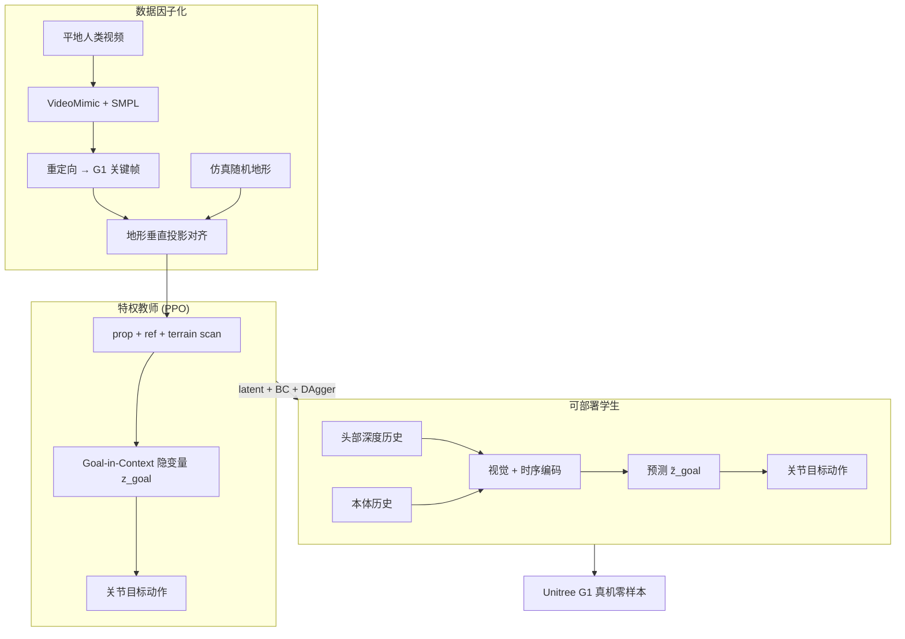

# VIGOR: Visual Goal-In-Context Inference for Unified Humanoid Fall Safety
**VIGOR：面向统一的人形机器人跌落安全的视觉上下文目标推理**

> 📅 阅读日期: 2026-04-21
>
> 🏷️ 板块: 04 Loco-Manipulation · 跌落安全 · 视觉全身控制
>
> 🧭 状态: 深度技术细节已填充（基于 arXiv:2602.16511 + 项目页）

---

## 📋 基本信息

| 项目 | 链接 |
|------|------|
| **arXiv** | [2602.16511](https://arxiv.org/abs/2602.16511) |
| **PDF** | [Download](https://arxiv.org/pdf/2602.16511.pdf) |
| **作者** | Osher Azulay, Zhengjie Xu, Andrew Scheffer, Stella X. Yu |
| **机构** | University of Michigan, Ann Arbor |
| **发布时间** | 2026-02 |
| **项目主页** | [vigor2026.github.io](https://vigor2026.github.io/) |
| **代码** | 🚧 暂未完全公开 |
| **实验平台** | Unitree G1（23-DoF + 头部 RealSense 深度相机） |
| **仿真** | HumanoidVerse（IsaacGym / IsaacLab 双后端） |

---

## 🎯 一句话总结

VIGOR 把跌落避免、撞击缓解与起身恢复**统一为单一视觉条件策略**：用少量平地人类跌落视频作稀疏结构先验，在仿真中因子化地形变化做 RL 训练；特权教师融合参考姿态与地形扫描得到 **Goal-in-Context 隐变量**，再蒸馏为仅依赖第一视角深度 + 本体感受的学生策略，在 Unitree G1 上**零样本**穿越楼梯、石堆等复杂地形。

---

## 📌 英文缩写速查

| 缩写 | 全称 | 简单解释 |
|------|------|----------|
| **GIC** | Goal-In-Context | 将下一目标姿态与局部地形融为一体的感知-运动隐表示 |
| **TSD** | Teacher-Student Distillation | 教师-学生蒸馏；特权信息 → 可部署策略 |
| **DAgger** | Dataset Aggregation | 逐步用学生动作 rollout、教师继续监督的模仿学习调度 |
| **PPO** | Proximal Policy Optimization | 教师策略 RL 算法 |
| **VideoMimic** | — | 单目视频 → SMPL 全身运动重建管线 |
| **MaskedMimic** | — | 关键帧 + 地形对齐的模仿学习框架（VIGOR 借鉴其投影对齐） |

---

## ❓ 这篇论文要解决什么问题？

### 1. 跌落安全被拆成孤岛

传统方案把 **跌落避免 / 撞击缓解 / 起身恢复** 分成独立模块：平衡控制器只管不倒，起身控制器只在机器人静止于少数预设姿态后才启动。但真实跌落中，**姿态、接触序列、最终支撑配置** 都由地形共同决定——恢复不能脱离"怎么摔"。

### 2. 端到端 RL/IL 把问题当成"单体数据复杂度"

- **RL**：奖励难设计，动作易不自然、脆弱
- **IL**：依赖密集轨迹或互联网人体数据，跨地形/接触条件迁移差
- 二者都把 **运动学 + 动力学 + 地形** 缠在一起，需要穷举组合，难扩展

### 3. 纯本体感受在复杂地形上不够用

楼梯边缘、碎石、窄台阶等 **接触可行性** 与 **动量重定向** 依赖局部几何，关节编码器看不见——起身时盲选支撑点常导致二次跌落。

> 💡 **核心主张**：人类跌落/恢复姿态远比表面自由——复杂地形上的可行姿态往往与平地存在**空间对齐**；把 **姿态先验** 与 **地形变化** 因子化，可用极少人类演示 + 仿真交互覆盖大范围场景。

---

## 🔧 方法详解

### 总览：四阶段管线

```
① 人类视频 → VideoMimic → SMPL → G1 运动重定向
② 稀疏关键帧提取 + 地形垂直投影对齐
③ 特权教师 PPO（参考 + 地形扫描 → GIC 隐变量 → 动作）
④ 学生蒸馏（深度历史 + 本体历史 → 预测 GIC → 动作）→ 真机零样本
```

### 1. 运动采集与稀疏关键帧

**数据来源**：平地单目人类跌落/恢复视频（前倒、侧倒、后倒），经 **VideoMimic** 重建 SMPL，再运动学重定向到 **Unitree G1**（保守关节限位防伪影）。

**规模**：3 种体型 × 3 类恢复行为 → **9 条**高质量序列（非密集轨迹跟踪！）。

**关键帧**：沿每条序列**均匀采样**稀疏关键帧，作为教师的**结构先验**而非逐帧模仿目标。

**地形对齐**（类似 MaskedMimic）：参考姿态先记录于平地，部署到起伏地形时做垂直投影：

\[
\Delta z = \max_{i=1,\dots,N_{\text{links}}} \bigl( h(\mathbf{p}^{\text{ref}}_i) - z^{\text{ref}}_i \bigr)
\]

所有参考连杆整体上移 \(\Delta z\) 以保证离地间隙；并在地形中心附近加小 \(x\)–\(y\) 扰动、随机参考轨迹与相位，扩覆盖。

### 2. 特权 Goal-in-Context 教师

**观测** \(\mathbf{o}^{\text{teach}}_t = (\mathbf{o}^{\text{prop}}_t,\, \mathbf{o}^{\text{ref}}_t,\, \mathbf{h}_t)\)：

| 分量 | 含义 |
|------|------|
| \(\mathbf{o}^{\text{prop}}\) | 本体感受（关节角/速、基座状态等） |
| \(\mathbf{o}^{\text{ref}}\) | 稀疏多演示参考信息 |
| \(\mathbf{h}_t\) | **特权地形扫描**（局部高度场） |

**GIC 隐变量**（核心）：

\[
\mathbf{z}^{\text{goal}}_t = g(\mathbf{o}^{\text{ref}}_t,\, \mathbf{h}_t)
\]

把 **下一恢复目标姿态** 与 **局部地形** 压进同一感知-运动空间，而非分开预测"看什么"和"做什么"。

**动作**：

\[
\mathbf{a}^{\text{teach}}_t = \pi_\theta(\mathbf{z}^{\text{goal}}_t,\, \mathbf{o}^{\text{prop}}_t)
\]

**训练**：两阶段 PPO——先在平地学基础跌倒缓解/起身，再在随机非平地继续（15 档连续难度：rough、waves、slope、inverted slope、stairs 等）。

### 3. 奖励设计

\[
r_t = r^{\text{imit}}_t + r^{\text{reg}}_t + r^{\text{post}}_t
\]

**模仿项** 用 **根相对坐标系** 比较参考与当前连杆，避免地形投影残差被误罚：

\[
(\mathbf{p}^{\text{ref}}_{i,t} - \mathbf{p}^{\text{ref}}_{0,t}) - (\mathbf{p}_{i,t} - \mathbf{p}_{0,t})
\]

高斯核 \(f(d;\sigma)=\exp(-d^2/\sigma)\) 作用于位置/旋转/速度/关节误差。

**正则与安全**：力矩、关节限位/速度/加速度、动量变化、动作平滑、非期望接触、**地形边缘支撑惩罚** 等。

**站起后稳定** \(r^{\text{post}}\)：奖励头部高度、惩罚残余基座线/角速度。

| 类别 | 代表项 | 权重量级 |
|------|--------|----------|
| 根相对位置跟踪 | RB pos. track. | 1.25 |
| 关节位置跟踪 | Joint pos. track. | 0.50 |
| 力矩惩罚 | Torque penalty | \(-10^{-6}\) |
| 地形边缘支撑 | Support at edge | \(-1.0\) |
| 站起后头部高度 | Head height | 0.25 |

### 4. 第一视角学生策略

部署时无特权地形/参考运动。学生观测：

\[
\mathbf{o}^{\text{stud}}_t = (\mathbf{I}_{t:t-k},\, \mathbf{o}^{\text{prop}}_{t:t-k})
\]

- \(\mathbf{I}_{t:t-k}\)：最近 \(k\) 帧**头部深度图**（CNN 编码 → \(\mathbf{f}^{\text{img}}_t\)）
- 本体历史：时序卷积 → \(\mathbf{f}^{\text{hist}}_t\)
- 融合预测 \(\tilde{\mathbf{z}}^{\text{goal}}_t\)

\[
\mathbf{a}^{\text{stud}}_t = \pi_\phi(\tilde{\mathbf{z}}^{\text{goal}}_t,\, \mathbf{o}^{\text{prop}}_t,\, \mathbf{f}^{\text{img}}_t)
\]

**蒸馏损失**：

\[
\mathcal{L}_{\text{latent}} = \|\tilde{\mathbf{z}}^{\text{goal}}_t - \mathbf{z}^{\text{goal}}_t\|^2,\quad
\mathcal{L}_{\text{BC}} = \|\mathbf{a}^{\text{stud}}_t - \mathbf{a}^{\text{teach}}_t\|^2
\]

**DAgger 调度**：rollout 中逐步用学生动作替换教师，同时持续 latent + action 监督。

### 5. 域随机化（Sim-to-Real）

**动力学**：摩擦/恢复系数、初始姿态、参考片段与相位、偏航/高度/关节初值、随机外推、关节力矩 dropout（模拟执行器部分失效）。

**感知**：深度裁剪与非线性重映射、乘性噪声、时空 dropout、合成遮挡、相机位姿微扰——迫使策略依赖稳定几何结构而非仿真特有视觉伪影。

---

## 🧭 整体流程（mermaid）



---

## 🚶 具体实例

### 实例 A：楼梯面朝下起身

机器人被推倒在**杂乱楼梯**上。VIGOR 不盲目站起，而是：

1. 深度图感知台阶边缘与可支撑面
2. GIC 隐变量编码"下一安全支撑姿态 + 局部几何"
3. 调整肢体接触顺序，避开易滑区域
4. 一气呵成完成 prone-to-stand

### 实例 B：被推向往楼梯的跌落缓解

基座已有非零速度时，策略在**下落过程中**用前臂等做**预判性接触**，在窄台阶上制动并再平衡——体现"统一生命周期"而非先摔稳再另起模块。

### 实例 C：多地形零样本泛化

训练分布含 rough / waves / slope / inverted slope / stairs 等 15 档难度；真机**无微调**部署，覆盖 face-up、side-fall 等多种初始条件。

---

## 🧪 实验与结果要点

| 设置 | 细节 |
|------|------|
| 机器人 | 23-DoF Unitree G1 + 头载深度相机 |
| 控制频率 | 50 Hz（策略）；本体 500 Hz；深度 30 Hz |
| 教师并行环境 | 4096（IsaacLab / IsaacGym） |
| 学生并行环境 | 512（含渲染成本） |
| 网络 | 轻量 MLP + 紧凑深度 CNN + 短时序卷积（ELU） |
| Episode | 最长 7.5 s |

**评估指标**（300 次试验平均）：

| 指标 | 含义 |
|------|------|
| **Succ** | 7.5 s 内恢复直立稳定 |
| **Succ_safe** | Succ 且头部未进入地形 5 cm 以内 |
| **Time** | 恢复耗时 |
| **Track.** | 非静止阶段相对参考 RMS 误差 |
| **Energy** | 机械功率 |
| **Disp.** | 骨盆漂移累积 |

**初始化两类**：Stand-Up（最低关键帧附近加噪）与 Fall-Recovery（跌落初段随机扰动）。

**对比基线**：

- **HOST**：分起始姿态单独 RL 起身（仅评估 stand-up）
- **FIRM**：目标扩散模型引导恢复
- 学生消融：去共享 latent 监督、去视觉、去 DAgger 等

**教师消融**：无关键点、关节角替代空间关键点、绝对跟踪、无地形扫描等——验证 GIC + 特权地形的关键性。

---

## 🏗️ 工程复现要点

1. **仿真栈**：HumanoidVerse 扩展地形生成与图像渲染；IsaacGym / IsaacLab 共用控制与学习模块
2. **数据**：9 条人类恢复序列即可作先验；重点在仿真地形因子化扩增
3. **教师先行**：平地收敛后再上复杂地形，避免早期接触爆炸
4. **学生渲染贵**：512 环境 + 深度历史窗口；latent 匹配比纯 BC 更稳
5. **真机部署**：深度预处理与仿真对齐；**零样本**无实机微调
6. **与 DeepMimic/AMP 差异**：非周期密集跟踪；稀疏关键帧 + 相对跟踪 + 视觉 GIC

---

## 🤖 工程价值

- **安全层标杆**：把"会走"升级为"摔了也能活"——野外/家庭部署必备
- **数据效率**：因子化复杂度 → 极少人类视频 + 仿真地形即可泛化
- **感知-控制一体**：GIC 隐变量避免"先建图再规划再跟踪"的慢链路
- **统一策略**：同一网络覆盖跌落全阶段，减少模块切换故障

---

## 🤔 局限性与失败模式

- 代码尚未完全公开，网络/超参细节主要在附录
- 深度相机在 rapid self-occlusion 时观测窄且不稳定
- 极端未见地形或硬件损伤场景仍可能失败
- 与 loco-manipulation 正任务共享算力/感知时的系统集成未展开

---

## 🎤 面试高频问题 & 参考回答

1. **VIGOR 和"分模块跌落+起身"方案的本质区别？**
   - 统一策略 + 视觉 GIC：跌落过程中就在选接触与动量方向，而不是摔完再换控制器；地形信息通过深度进入同一隐空间。

2. **为什么少量人类演示就够？**
   - 论文主张恢复姿态流形低维且可跨地形对齐；地形/contact 时序由 RL 在仿真中补全，避免 monolithic 数据覆盖。

3. **GIC 隐变量 vs 显式地形预测？**
   - 不单独预测高度图或参考轨迹；直接学"在此情境下下一目标姿态应是什么"的联合表示，更适合毫秒级全身反应。

4. **学生如何保证匹配教师？**
   - 双监督（latent + action）+ DAgger 混合 rollout；深度域随机化减轻 sim-to-real 视觉差距。

---

## 🔗 与路线图其他论文的关联

| 论文 | 关系 |
|------|------|
| **DeepMimic / PHC** | 跟踪式奖励与相对坐标模仿；VIGOR 改为稀疏关键帧 + 地形投影 |
| **AMP / ASE** | 运动先验正则化；VIGOR 用人类恢复先验而非风格判别器 |
| **Expressive WBC / ULTRA** | 全身控制主线；VIGOR 补"极端失衡"安全层 |
| **HERO** | 同 UIUC 系 loco-manip；HERO 偏精确 EE 操作，VIGOR 偏跌倒生存 |

---

## 💬 讨论记录

（暂无）

---

## 📎 附录

### A. 参考来源

- [arXiv:2602.16511](https://arxiv.org/abs/2602.16511)
- [Project: vigor2026.github.io](https://vigor2026.github.io/)
- VideoMimic、MaskedMimic、HumanoidVerse 等相关工作（论文 Related Work）
